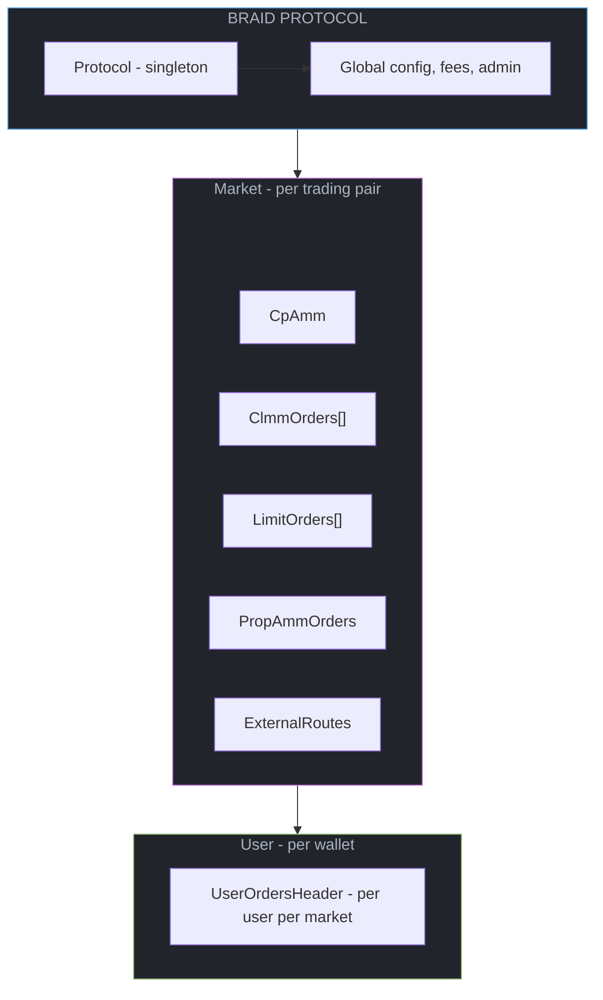
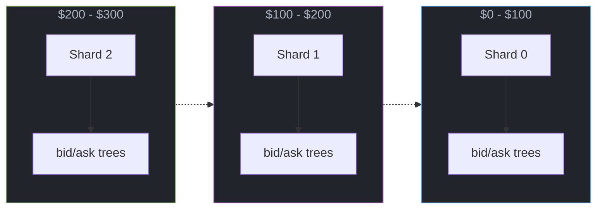
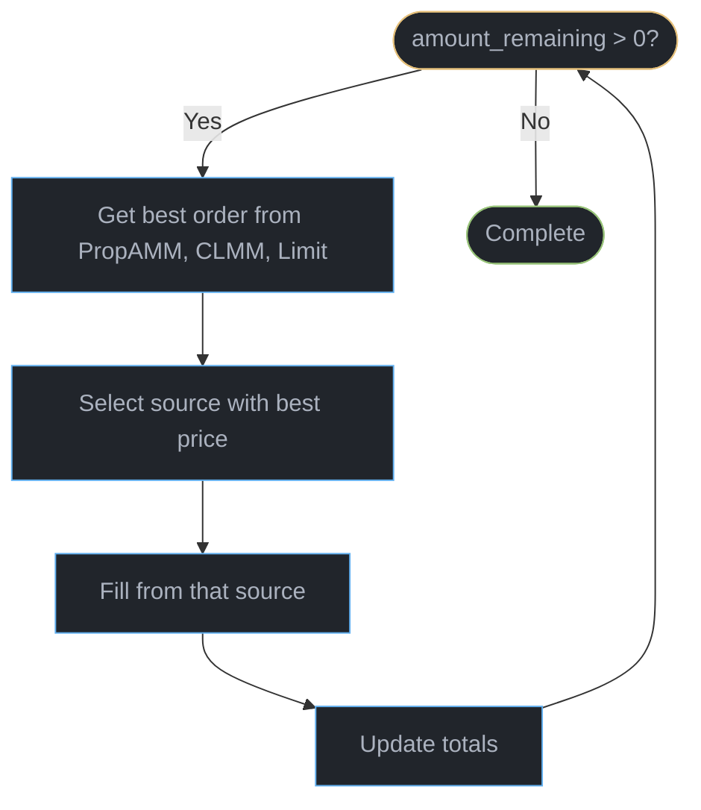
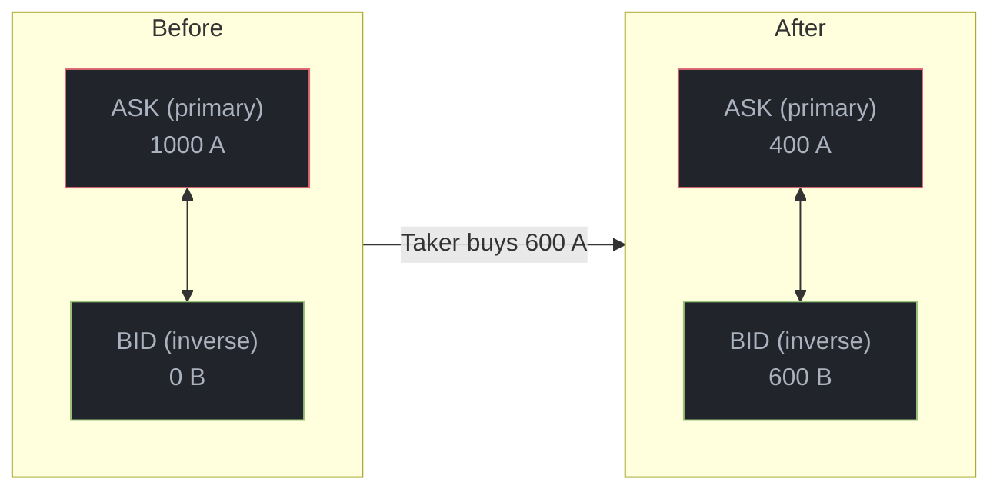

# Architecture

Braid is built on a sharded orderbook architecture that enables unlimited scalability while maintaining efficient on-chain matching.

## System Overview



## Sharding Strategy

Orders are distributed across **shards** (separate Solana accounts) by price range:



### Why Sharding?

| Challenge | Solution |
|-----------|----------|
| Solana's 10MB account limit | Split orderbook across multiple accounts |
| Transaction account limits | Only load shards near current price |
| CU constraints | Process orders in relevant shard only |

### Shard Invariants

- Markets always have **≥3 shards** (initialized on market creation)
- Each shard has valid `nextBidsShard`/`nextAsksShard` chain pointers
- Shards auto-split at **75% capacity**, merge at **25%**
- 50% hysteresis "dead zone" prevents thrashing

## Embedded Tree Architecture

Tree nodes are embedded directly in order structs (no separate index accounts):

```rust
pub struct ClmmOrder {
    pub base: BaseOrder,      // 56 bytes - core order data
    pub inverse_idx: u32,     // Link to paired order
    pub price_node: PriceNode, // 32 bytes - embedded tree node
}
```

### Benefits

<CardGroup cols={2}>
  <Card title="No Cross-Account Coordination" icon="link-slash">
    Tree operations are local to each shard
  </Card>
  <Card title="O(1) Best Price" icon="bolt">
    Cached min/max indices for instant lookups
  </Card>
  <Card title="Reduced CU" icon="gauge-high">
    Single account read/write per shard
  </Card>
  <Card title="Simpler Logic" icon="code">
    Tree and order data always in sync
  </Card>
</CardGroup>

## Matching Engine

The matching engine uses a **greedy multi-source routing algorithm**:



### Source Priority

Orders are selected purely by **best available price**:
- For buys (taking asks): lowest price wins
- For sells (taking bids): highest price wins

No preference is given to any order type - pure price competition.

## CLMM Paired Orders

CLMM orders always exist as **bid+ask pairs**:



When filled, liquidity **flips** to the inverse - no allocation needed.

## Crank Operations

Shards require permissionless maintenance via **crank** instructions:

| Instruction | Trigger | Action |
|-------------|---------|--------|
| `CrankSplit` | Shard >75% full, neighbors full | Create new shard, migrate orders |
| `CrankMerge` | Shard &lt;25% full, neighbor sparse | Combine shards, reclaim account |
| `CrankRebalance` | Shard &lt;25% full, neighbor has room | Move orders to neighbor |

Shard balancing is handled automatically during CLMM/limit order placement or during take operations, making external cranking purely optional.
