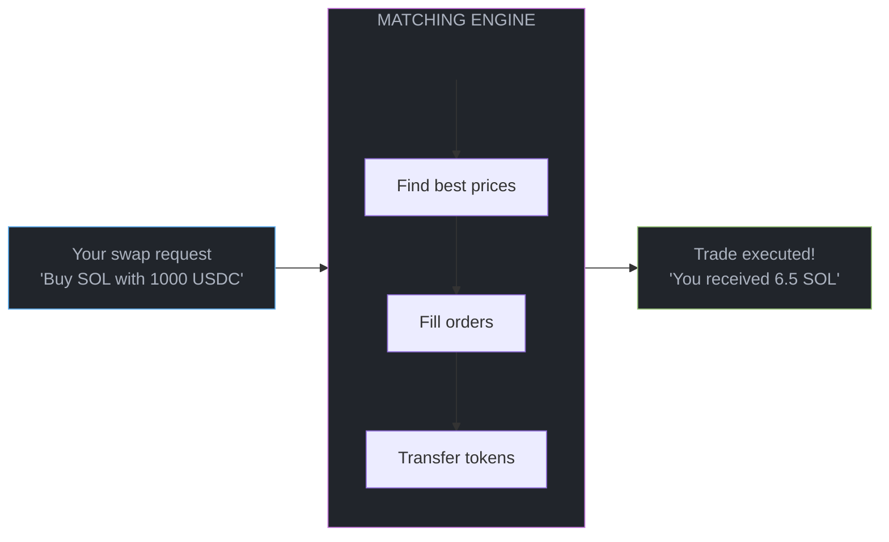
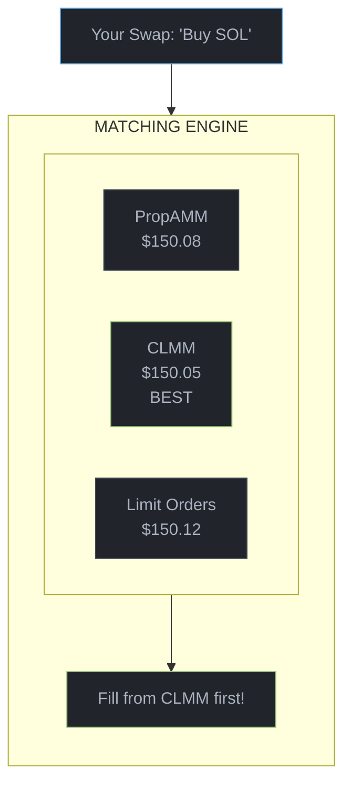
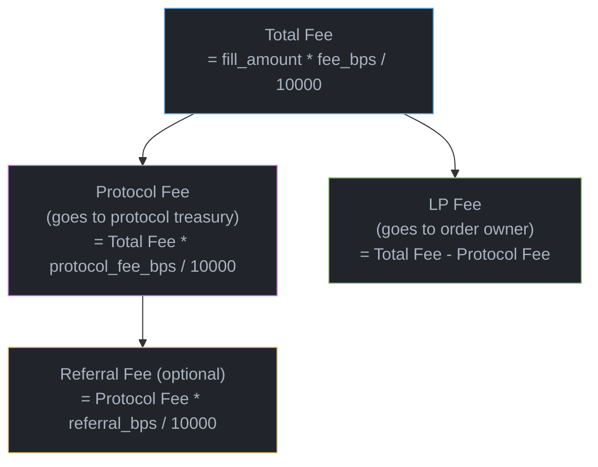

# Matching Engine

The matching engine is the heart of Braid - it's the code that finds the best prices and executes trades. This page explains how it works, from simple concepts to detailed algorithms.

## What Is a Matching Engine?

When you want to swap USDC for SOL, someone else needs to be willing to sell SOL for USDC. The matching engine's job is to:

1. **Find sellers** with the best prices
2. **Match** your buy with their sell
3. **Execute** the trade (move tokens)



## Multi-Source Routing

Unlike simple DEXs that only have one source of liquidity, Braid has **three different order types** competing to fill your trade:



The engine always picks the **best price** regardless of order type. This means:
- You get the best execution
- Order types compete on price
- Liquidity providers are incentivized to offer good prices

## How a Swap Works (Step by Step)

Let's trace through a real swap: **Buy SOL with 100 USDC**

### Step 1: Submit the Swap

```typescript
const ix = await market.swap({
  side: 'ask',                 // Buying from asks
  amount: 100_000_000n,        // 100 USDC
  minOut: 650_000_000n,        // At least 0.65 SOL (slippage protection)
  taker: wallet.publicKey,
});
```

### Step 2: Find Best Prices

The engine queries all order sources:

```
Checking prices...

PropAMM Orders:
  Best ask: $153.50 (10 SOL available)

CLMM Orders:
  Shard 0: No asks in range
  Shard 1: Best ask: $150.05 (5 SOL available)
  Shard 2: Best ask: $151.20 (8 SOL available)

Limit Orders:
  Shard 1: Best ask: $150.50 (3 SOL available)
  Shard 2: Best ask: $152.00 (12 SOL available)

Winner: CLMM Shard 1 @ $150.05
```

### Step 3: Fill the Best Order

```
Filling from CLMM @ $150.05...

Your 100 USDC can buy: 100 / 150.05 = 0.6664 SOL
But only 5 SOL available at this price.

Actually fill: 0.6664 SOL (order fully consumed)
Remaining to fill: 0 (we're done!)

Total output: 0.6664 SOL
```

### Step 4: Transfer Tokens

```
Token transfers:
  You → Vault:    100 USDC
  Vault → You:    0.6631 SOL (after 0.5% fee)

Transaction complete!
```

## Swap Parameters Explained

When you call `take()`, you provide these parameters:

```typescript
interface TakeParams {
  amount: bigint;            // How much you're spending
  minOut: bigint;            // Minimum you'll accept (slippage protection)
  side: 'ask' | 'bid';       // 'ask' = buying base, 'bid' = selling base
  taker: PublicKey;          // Taker wallet
  minOrderBips?: number;     // Optional: Skip tiny orders (saves compute)
  maxOrders?: number;        // Optional: Max orders to fill (saves compute)
}
```

### Understanding Each Parameter

| Parameter | What It Does | Example |
|-----------|--------------|---------|
| `amount` | Input amount to swap | `100_000_000n` = 100 USDC |
| `minOut` | Revert if output below this | `650_000_000n` = 0.65 SOL |
| `side` | Direction of trade | `Ask` = buy, `Bid` = sell |
| `minOrderBips` | (Optional) Skip orders smaller than X% | `100` = skip orders &lt;1% |
| `maxOrders` | (Optional) Stop after N fills | `10` = max 10 orders |

### Slippage Protection

The `minOut` parameter protects you from bad fills:

```
Without minOut:
  You submit: Buy SOL with 100 USDC
  Price moves while tx pending
  You receive: 0.5 SOL (terrible rate!)

With minOut = 0.65 SOL:
  You submit: Buy SOL with 100 USDC, minOut = 0.65
  Price moves while tx pending
  Output would be: 0.5 SOL
  Transaction REVERTS (you keep your USDC!)
```

<Note>
**Tip**: Calculate `minOut` as `expectedOutput * (1 - slippageTolerance)`. For 1% slippage: `minOut = expectedOutput * 99n / 100n`.
</Note>

## The Matching Algorithm

Here's the actual algorithm the matching engine uses:

```
ALGORITHM: OrderbookTake

INPUT: amount, minOut, side, maxOrders (optional)

total_output = 0
amount_remaining = amount
orders_touched = 0

WHILE amount_remaining > 0 AND orders_touched < maxOrders:

    // 1. Find best price from all sources
    best = null
    FOR EACH source IN [PropAMM, CLMM, Limit]:
        candidate = source.getBestOrder(side)
        IF candidate != null AND isBetter(candidate, best, side):
            best = candidate

    // 2. Check if we should stop
    IF best == null:
        BREAK  // No more orders

    IF best.amount < amount_remaining * minOrderBips / 10000:
        source.skipOrder(best)
        CONTINUE

    // 3. Calculate fill
    fill_amount = MIN(best.amount, amount_remaining)
    output = calculateOutput(fill_amount, best.price, side)

    // 4. Execute fill
    source.fill(best, fill_amount)
    total_output += output
    amount_remaining -= fill_amount
    orders_touched++

// 5. Check slippage
IF total_output < minOut:
    REVERT("SlippageExceeded")

// 6. Transfer tokens
transfer(taker → vault_in, amount - amount_remaining)
transfer(vault_out → taker, total_output - fees)

RETURN total_output
```

## Order Type Fill Behavior

Each order type fills slightly differently:

<Tabs>
  <Tab title="Limit Orders">
    **Simple fill**: Reduce order amount, remove if empty.

    ```
    Before: Order #42: Sell 10 SOL @ $150
    Fill: 6 SOL

    After: Order #42: Sell 4 SOL @ $150
           (order stays in book with reduced size)

    If fill = 10 SOL:
    After: Order #42 removed from book
    ```
  </Tab>
  <Tab title="CLMM Orders">
    **Fill with flip**: Filled amount moves to inverse side.

    ```
    Before:
      Primary ASK: Sell 10 SOL @ $150-160
      Inverse BID: Buy 0 SOL worth

    Fill: 6 SOL from ASK

    After:
      Primary ASK: Sell 4 SOL @ $155-160 (remaining range)
      Inverse BID: Buy ~$900 worth @ $150-155 (flipped!)

    The filled portion becomes liquidity on the other side.
    This is automated market making!
    ```
  </Tab>
  <Tab title="PropAMM Orders">
    **Slot-scoped fill**: Same as limit, but order expires after slot.

    ```
    Slot 12345:
      Order #99: Sell 10 SOL @ $150 (slot 12345)
      Fill: 6 SOL
      After: Order #99: Sell 4 SOL @ $150

    Slot 12346:
      Order #99 expires automatically
      (any unfilled portion is gone)
    ```
  </Tab>
</Tabs>

## Protection Mechanisms

The matching engine has several protections against abuse:

### Compute Unit Protection

| Mechanism | Purpose |
|-----------|---------|
| `maxOrders` | Cap fills to stay within CU budget |
| `minOrderBips` | Skip dust orders |

### Price Protection

| Mechanism | Purpose |
|-----------|---------|
| `minOut` | Revert if output too low |

### Example: Avoiding Dust Griefing

Without protection, an attacker could place thousands of 0.00001 SOL orders:

```
Attack: 1000 orders of 0.00001 SOL each
Your swap: Buy 1 SOL

Without protection:
  Fill order 1: 0.00001 SOL (500 CU)
  Fill order 2: 0.00001 SOL (500 CU)
  ...
  Transaction runs out of compute units!

With minOrderBips = 100 (1%):
  Order 1: 0.00001 SOL < 1% of 1 SOL → SKIP
  Order 2: 0.00001 SOL < 1% of 1 SOL → SKIP
  Tiny orders skipped, fill from real orders
```

## Getting Quotes

Before executing a swap, you can get a quote to see expected output:

```typescript
// Get quote for buying SOL with 100 USDC
const quote = await market.getQuote({
  side: 'ask',
  amount: 100_000_000n,  // 100 USDC
});

console.log('Expected output:', quote.expectedOutput);   // e.g., 666400000n (0.6664 SOL)
console.log('Price impact:', quote.priceImpact);        // e.g., 0.05 (0.05%)
console.log('Orders to fill:', quote.ordersToFill);     // e.g., 3

// Calculate minOut with 0.5% slippage tolerance
const minOut = quote.expectedOutput * 995n / 1000n;
```

---

## Technical Deep Dive

<Accordion title="Output Calculation">

The output for each fill depends on the trade direction:

```rust
// Price is expressed as: quote_per_base * 10^base_decimals
// Example: $150 = 150_000_000 (with 6 decimal USDC)

fn calculate_output(fill: u64, price: u64, side: Side, base_scale: u64) -> u64 {
    match side {
        // Buying base (giving quote): output = input * base_scale / price
        Side::Ask => fill * base_scale / price,

        // Selling base (giving base): output = input * price / base_scale
        Side::Bid => fill * price / base_scale,
    }
}
```

### Example Calculation

Buy SOL with 100 USDC at $150:
- `fill = 100_000_000` (100 USDC, 6 decimals)
- `price = 150_000_000` ($150 in 6 decimals)
- `base_scale = 1_000_000_000` (SOL has 9 decimals)

```
output = 100_000_000 * 1_000_000_000 / 150_000_000
       = 100_000_000_000_000_000 / 150_000_000
       = 666_666_666 (0.666... SOL)
```

</Accordion>

<Accordion title="Fee Distribution">

Fees are collected during matching and distributed as follows:



### Fee Example

10 SOL fill, 30 bps fee, 10% protocol cut:

```
Total fee:     10 SOL * 30 / 10000 = 0.03 SOL
Protocol fee:  0.03 SOL * 10 / 100 = 0.003 SOL
LP fee:        0.03 - 0.003 = 0.027 SOL

Final: LP gets 0.027 SOL, protocol gets 0.003 SOL
```

</Accordion>

<Accordion title="Price Comparison Logic">

The engine must compare prices correctly for each side:

```rust
fn is_better_price(a: u64, b: u64, side: Side) -> bool {
    match side {
        // For asks (buying base): lower price is better
        // You want to pay LESS per unit
        Side::Ask => a < b,

        // For bids (selling base): higher price is better
        // You want to receive MORE per unit
        Side::Bid => a > b,
    }
}
```

</Accordion>

---

## Optimal Price Discovery

The Braid matching engine finds the **optimal equilibrium price** that maximizes output across all liquidity sources simultaneously.

<Note>
Simple greedy matching (fill best price first) can miss opportunities where splitting across multiple orders gives better total output. Braid's matching engine finds the mathematically optimal allocation.
</Note>

### The Optimization Problem

Given input amount `I` and a set of order curves, the engine finds the equilibrium price `P*` where total supply equals total demand:

$$
\sum_{i} f_i(P^*) = I
$$

```
Example: Two overlapping CLMM orders

Order A: 100 SOL @ $150-160 (exponent n=2)
Order B: 80 SOL @ $148-155 (exponent n=2)

Input: 50 SOL worth of buying pressure

Greedy approach:
  Fill Order B first (starts at lower price $148)
  Then fill Order A

Optimal approach:
  Find P* where filling both orders proportionally
  gives better average price than greedy
```

### Three-Phase Matching

The matching algorithm has three phases:

```
PHASE 1: COLLECT
──────────────────
Gather all qualifying orders into "active set"
  - PropAMM orders from current/last slot
  - CLMM orders from loaded shards
  - Limit orders from loaded shards
  - CP-AMM modeled as single virtual order

Active set size: up to 512 orders


PHASE 2: SOLVE
────────────────────────────────
Find the equilibrium price P* that clears the market


PHASE 3: EXECUTE
─────────────────
For each order in active set:
  1. Compute fill amount at P*
  2. Apply to order (reduce remaining, flip if CLMM)
  3. Accumulate fees and outputs

Transfer tokens between taker and vaults
```

---

## Further Reading

<CardGroup cols={2}>
  <Card title="Order Curves" icon="chart-line" href="/concepts/order-curves">
    Mathematical foundation of power-law density functions
  </Card>
  <Card title="Security & MEV" icon="shield" href="/concepts/security">
    How Braid protects against front-running and sandwich attacks
  </Card>
</CardGroup>
