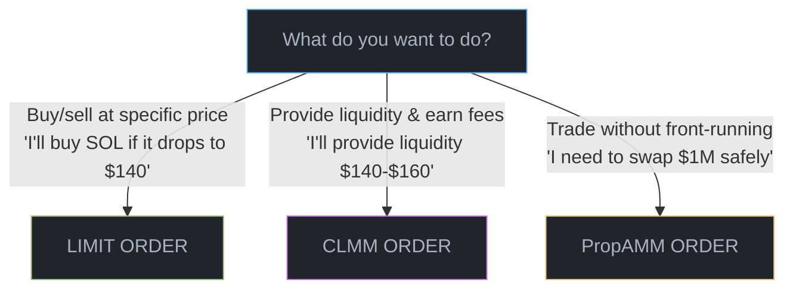
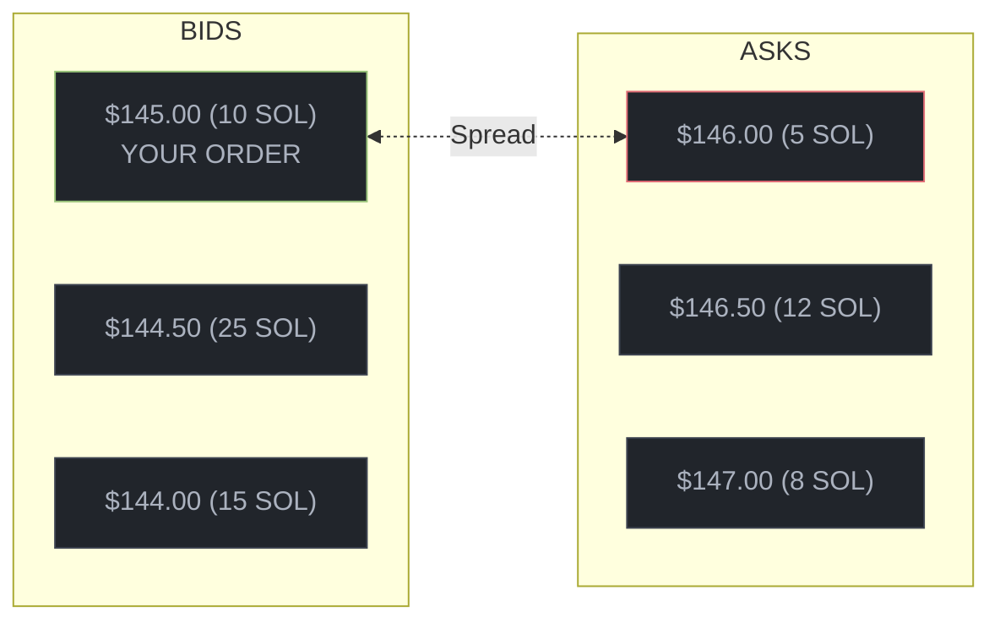
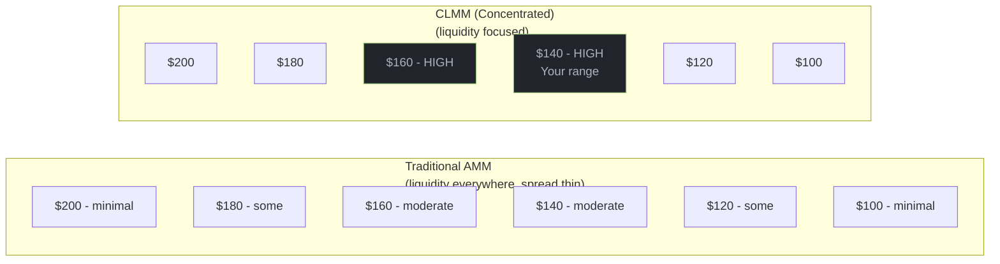
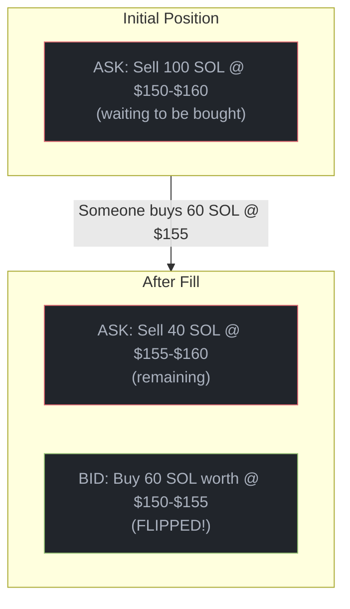
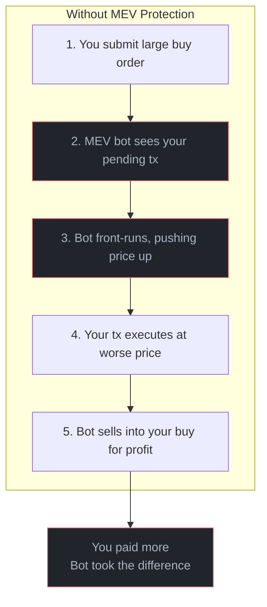
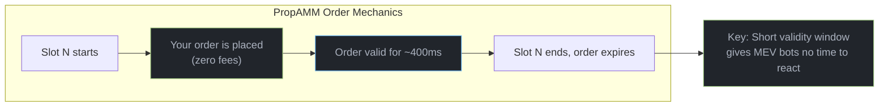

# Order Types

Braid supports three different order types, each designed for specific trading scenarios. This guide explains what each type does, when to use it, and the tradeoffs involved.

## Quick Decision Guide

Not sure which order type to use? Here's a simple flowchart:



## Comparison Table

| Feature | Limit Orders | CLMM Orders | PropAMM Orders |
|---------|--------------|-------------|----------------|
| **What it does** | Buy/sell at exact price | Provide liquidity in range | Trade with MEV protection |
| **Price type** | Single price | Price range | Single price + slot fee |
| **Best for** | Simple trading | Market making | Large/sensitive trades |
| **Complexity** | Easy | Medium | Advanced |
| **Earns fees?** | Yes (when filled) | Yes (continuous) | No |
| **Paired?** | No (one-sided) | Yes (bid+ask) | No (one-sided) |
| **Lifetime** | Until filled/cancelled | Until filled/cancelled | One slot (~400ms) |

---

## 1. Limit Orders

The simplest order type. You specify a price and amount, and your order sits on the book until someone trades against it.

### How It Works



Your order waits until someone sells at $145 or less. When filled, you receive SOL and they receive your USDC.

### When to Use

- **Simple trading**: "Buy SOL if it drops to $X"
- **Take-profit orders**: "Sell my SOL when it hits $200"
- **Market making with fixed prices**: Post both bids and asks at specific levels

### Example Code

<Tabs>
  <Tab title="TypeScript">
```typescript
import { Side } from '@braid/client';

// Place a buy order: 10 SOL at $145
const tx = await market.placeLimitOrder({
  side: Side.Bid,                    // Bid = buy
  price: 145_000_000n,               // $145.00 (6 decimals)
  amount: 10_000_000_000n,           // 10 SOL (9 decimals)
  owner: wallet.publicKey,
  expiresAt: 0,                      // 0 = never expires
});

// Or with expiration (GTC = good-til-cancelled, GTD = good-til-date)
const txWithExpiry = await market.placeLimitOrder({
  side: Side.Ask,                    // Ask = sell
  price: 155_000_000n,               // $155.00
  amount: 5_000_000_000n,            // 5 SOL
  owner: wallet.publicKey,
  expiresAt: Math.floor(Date.now() / 1000) + 3600, // Expires in 1 hour
});
```
  </Tab>
</Tabs>

### Key Points

- **Fill-or-remain**: Your order fills immediately if there's a matching order, otherwise it stays on the book
- **FIFO execution**: Orders at the same price fill in first-in-first-out order
- **Fees on fill**: You pay fees only when your order gets filled (not when placing)
- **Expiration rules**: If using expiration, it must be at least 60 seconds in the future

<Note>
**Tip**: For immediate execution, set your price slightly worse than the best price. For example, to buy immediately, bid slightly above the best ask.
</Note>

---

## 2. CLMM Orders (Concentrated Liquidity)

CLMM (Concentrated Liquidity Market Maker) orders let you provide liquidity across a price range instead of a single price. This is more capital efficient than traditional AMMs.

### How It Works

Think of CLMM as saying: "I'll buy and sell in this price range, and earn fees from every trade that happens within my range."



Same capital, but CLMM earns 10-100x more fees because it's concentrated where trading happens.

### The "Flip" Mechanism

When your CLMM order gets filled on one side, the filled amount automatically "flips" to the other side:



The filled portion becomes a bid, ready to buy back if the price drops. This is automatic market making.

### When to Use

- **Market making**: Earn fees by providing two-sided liquidity
- **Range trading**: Accumulate tokens in a price range you expect to oscillate
- **Capital efficiency**: Get more from your capital than traditional LPing

### Example Code

<Tabs>
  <Tab title="TypeScript">
```typescript
import { placeClmmPosition, Side } from '@braid/client';

// Provide liquidity between $145-$155
const tx = await placeClmmPosition({
  market: marketAddress,
  side: Side.Ask,                    // Start as an ask (selling)
  pMin: 145_000_000n,                // Lower bound: $145
  pMax: 155_000_000n,                // Upper bound: $155
  amount: 100_000_000_000n,          // 100 SOL worth of liquidity
  owner: wallet.publicKey,
});

// Narrower range = more concentrated = more fees (but more risk)
const narrowRange = await placeClmmPosition({
  market: marketAddress,
  side: Side.Bid,
  pMin: 148_000_000n,                // $148
  pMax: 152_000_000n,                // $152 (only $4 range!)
  amount: 50_000_000_000n,
  owner: wallet.publicKey,
});
```
  </Tab>
</Tabs>

### Key Points

- **Paired orders**: Every CLMM creates linked bid+ask that share liquidity
- **Continuous earning**: Earn fees on every trade in your range
- **Impermanent loss**: If price moves outside your range, you may end up holding only one token
- **Range selection**: Narrower range = more fees but more IL risk

<Note>
**Warning**: CLMM orders have impermanent loss risk. If SOL price goes from $150 to $200, your position will be 100% USDC (you sold all your SOL on the way up). Only use CLMM if you understand this risk.
</Note>

---

## 3. PropAMM Orders (MEV Protection)

PropAMM orders are designed to protect large trades from MEV (Maximal Extractable Value) attacks like front-running and sandwich attacks.

### The MEV Problem

Without protection, large trades can be exploited:



### How PropAMM Protects You

PropAMM orders are only valid for a single Solana slot (~400ms) and have **zero fees**:



### When to Use

- **Large trades**: Moving significant value where MEV matters
- **Price-sensitive trades**: When getting the exact quoted price is important
- **Programmatic trading**: Bots that need predictable execution

### Example Code

<Tabs>
  <Tab title="TypeScript">
```typescript
import { placePropOrder, Side, getCurrentSlot } from '@braid/client';

// Get the current slot
const currentSlot = await getCurrentSlot(connection);

// Place a PropAMM order valid only for this slot
const tx = await placePropOrder({
  market: marketAddress,
  side: Side.Bid,
  slot: currentSlot,                 // Valid for this slot only
  price: 150_000_000n,               // $150
  amount: 10_000_000_000_000n,       // 10,000 SOL
  owner: wallet.publicKey,
});

// Submit immediately - order expires in ~400ms!
await sendAndConfirmTransaction(connection, tx, [wallet]);
```
  </Tab>
</Tabs>

### Key Points

- **Short-lived**: Orders expire after one slot (~400ms)
- **Zero fees**: PropAMM orders have no trading fees
- **Best for large trades**: The protection is most valuable for big orders
- **Requires speed**: You must submit quickly before the slot ends

<Note>
**Advanced**: PropAMM is most effective when combined with private transaction submission (like Jito bundles) to prevent your order from being seen in the mempool.
</Note>

---

## Choosing the Right Order Type

<Tabs>
  <Tab title="I'm a regular trader">
    **Use Limit Orders**

    Best for everyday trading where you want to buy at a specific price or sell at a target.

    ```typescript
    // Buy when price drops
    await market.placeLimitOrder({
      side: Side.Bid,
      price: 145_000_000n,  // Buy at $145
      amount: 10_000_000_000n,
    });

    // Sell at profit target
    await market.placeLimitOrder({
      side: Side.Ask,
      price: 160_000_000n,  // Sell at $160
      amount: 10_000_000_000n,
    });
    ```
  </Tab>
  <Tab title="I'm a liquidity provider">
    **Use CLMM Orders**

    Best for earning fees by providing two-sided liquidity.

    ```typescript
    // Provide liquidity around current price
    const currentPrice = await market.getMidPrice();
    const range = currentPrice / 20n; // 5% range

    await placeClmmPosition({
      pMin: currentPrice - range,
      pMax: currentPrice + range,
      amount: liquidityAmount,
      side: Side.Ask,
    });
    ```
  </Tab>
  <Tab title="I'm trading large size">
    **Use PropAMM Orders**

    Best for protecting large trades from MEV.

    ```typescript
    // Large trade with MEV protection
    const slot = await getCurrentSlot(connection);

    await placePropOrder({
      slot: slot,
      price: 150_000_000n,
      amount: 100_000_000_000_000n, // $10M+ trade
      side: Side.Bid,
    });
    ```
  </Tab>
</Tabs>

---

## Technical Deep Dive

<Accordion title="Order Data Structures">

### Limit Order Structure

```rust
struct LimitOrder {
    // Identity
    owner: Address,           // 32 bytes - Order owner
    order_id: u64,            // 8 bytes - Unique ID

    // Order data
    price: u64,               // 8 bytes - Limit price (scaled)
    amount: u64,              // 8 bytes - Remaining amount
    filled_amount: u64,       // 8 bytes - Amount filled so far
    side: u8,                 // 1 byte - 0=bid, 1=ask

    // Expiration
    created_at: i64,          // 8 bytes - Unix timestamp
    expires_at: i64,          // 8 bytes - 0 = never expires

    // Tree node (embedded for O(log n) operations)
    left: u32,                // 4 bytes - Left child index
    right: u32,               // 4 bytes - Right child index
    parent: u32,              // 4 bytes - Parent index
    color: u8,                // 1 byte - Red-black tree color
}
// Total: 88 bytes per order
```

### CLMM Order Structure

```rust
struct ClmmOrder {
    // Identity
    owner: Address,           // 32 bytes
    order_id: u64,            // 8 bytes

    // Range parameters
    p_min: u64,               // 8 bytes - Lower price bound
    p_max: u64,               // 8 bytes - Upper price bound
    exponent: u8,             // 1 byte - Density curve exponent

    // Liquidity state
    amount: u64,              // 8 bytes - Total liquidity
    filled_a: u64,            // 8 bytes - Filled in token A
    filled_b: u64,            // 8 bytes - Filled in token B

    // Pairing
    inverse_idx: u32,         // 4 bytes - Index of paired order
    side: u8,                 // 1 byte - Primary side

    // Tree node
    left: u32,
    right: u32,
    parent: u32,
    color: u8,
}
// Total: 96 bytes per order
```

### PropAMM Order Structure

```rust
struct PropAmmOrder {
    // BaseOrder (64 bytes)
    base: BaseOrder,          // Contains order_id, maker_id, amounts, price range

    // PropAMM specific
    signer: Pubkey,           // 32 bytes - Who placed this order
    placed_slot: u64,         // 8 bytes - Slot when placed (for validity check)

    // Tree nodes
    price_node: PriceNode,    // 40 bytes
    maker_node: MakerNode,    // 32 bytes
}
// Total: 176 bytes per order
// Note: PropAMM orders have ZERO fees (no fee fields needed)
```

</Accordion>

<Accordion title="Fee Calculation">

### Limit Order Fees

```
Taker Fee = fill_amount * limit_fee_bps / 10000
Maker Fee = 0 (makers don't pay)
Protocol Fee = Taker Fee * protocol_fee_bps / 10000
```

### CLMM Order Fees

```
Base Fee = fill_amount * clmm_fee_bps / 10000
Protocol Fee = Base Fee * protocol_fee_bps / 10000
LP Fee = Base Fee - Protocol Fee (goes to liquidity provider)
```

### PropAMM Order Fees

PropAMM orders have **zero fees**. This compensates makers for the extremely short order lifetime (~1 slot / 400ms).

```
Fee = 0 bps (no base fee, no slot fee)
```

The MEV protection comes from slot-scoping, not from fee mechanics.

</Accordion>

<Accordion title="Density Curves (CLMM)">

CLMM orders use a power-law density curve to distribute liquidity:

```
d(t) = n * t^(n-1)

Where:
- t = normalized position in range [0, 1]
- n = exponent (typically 1-4)
- d(t) = density at position t
```

### Effect of Exponent

| Exponent | Behavior |
|----------|----------|
| n = 1 | Uniform distribution (flat) |
| n = 2 | Linear increase toward range edge |
| n = 3 | Quadratic increase (more concentrated at edges) |
| n = 4 | Highly concentrated at range boundaries |

```
n=1 (uniform)     n=2 (linear)      n=4 (concentrated)
    ████████          ██████████        ████████████████
    ████████          ██████████        ████████████████
    ████████          ████████          ████████████████
    ████████          ██████            ██████████
    ████████          ████              ██████
    ████████          ██                ██
```

Higher exponents provide more liquidity at range boundaries, which is useful when you expect price to mean-revert within your range.

</Accordion>
