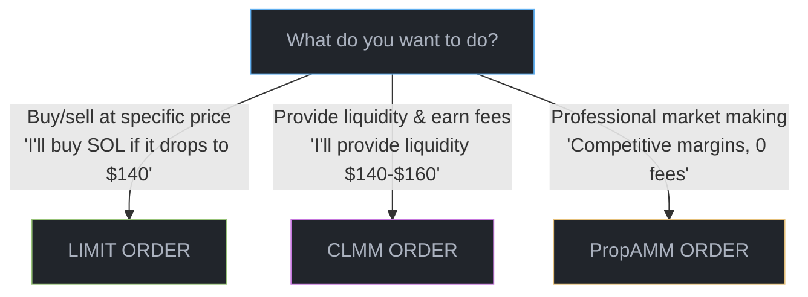
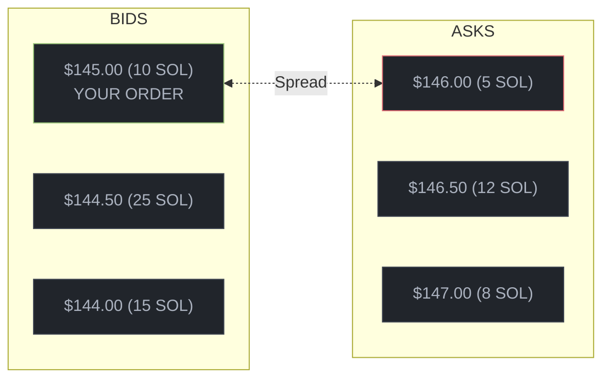
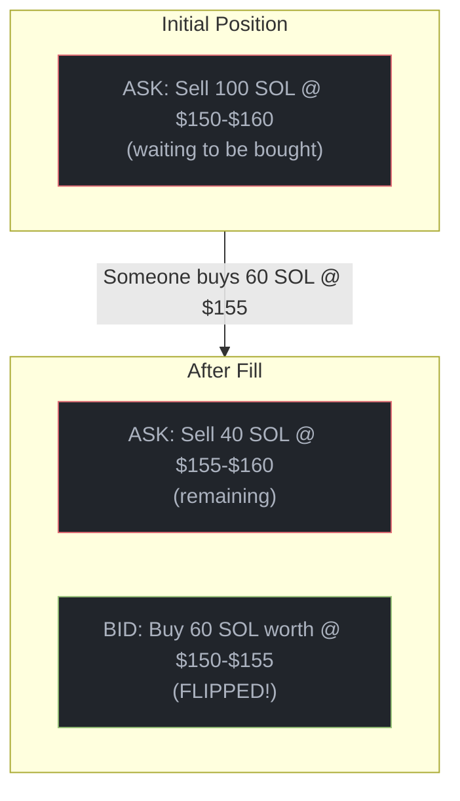

# Order Types

Braid supports three different order types, each designed for specific trading scenarios. This guide explains what each type does, when to use it, and the tradeoffs involved.

## Quick Decision Guide

Not sure which order type to use? Here's a simple flowchart:



## Comparison Table

| Feature | Limit Orders | CLMM Orders | PropAMM Orders |
|---------|--------------|-------------|----------------|
| **What it does** | Buy/sell in price range | Provide liquidity in range | Professional market making |
| **Price type** | Price range (density curve) | Price range (density curve) | Single price |
| **Best for** | Simple trading | Passive liquidity | Competitive spreads, 0 fees |
| **Complexity** | Easy | Medium | Advanced |
| **Braid fees** | Yes | Yes | No |
| **Paired?** | No (one-sided) | Yes (bid+ask) | No (one-sided) |
| **Lifetime** | Until filled/cancelled | Until filled/cancelled | One slot (~400ms) |

---

## 1. Limit Orders

The simplest order type. You specify a price and amount, and your order sits on the book until someone trades against it.

### How It Works



Your order waits until someone sells at $145 or less. When filled, you receive SOL and they receive your USDC.

### When to Use

- **Simple trading**: "Buy SOL if it drops to $X"
- **Take-profit orders**: "Sell my SOL when it hits $200"
- **Market making with fixed prices**: Post both bids and asks at specific levels

### Example Code

<Tabs>
  <Tab title="TypeScript">
```typescript
// Place a buy order: bid across $140-$145 range
const ix = await market.placeLimitOrder({
  side: 'bid',
  pMin: 140_000_000n,              // $140.00 (6 decimals)
  pMax: 145_000_000n,              // $145.00 (6 decimals)
  amount: 1_450_000_000n,          // 1450 USDC (6 decimals)
  // exponent defaults to 0 (uniform)
  owner: wallet,
});

// Sell order with concentrated curve (more liquidity at higher prices)
const ixConcentrated = await market.placeLimitOrder({
  side: 'ask',
  pMin: 150_000_000n,              // $150.00
  pMax: 160_000_000n,              // $160.00
  amount: 5_000_000_000n,          // 5 SOL (9 decimals)
  exponent: 2,                     // Quadratic concentration
  owner: wallet,
});
```
  </Tab>
</Tabs>

### Key Points

- **Fill-or-remain**: Your order fills immediately if there's a matching order, otherwise it stays on the book
- **Density curves**: Control how liquidity is distributed across your price range (Uniform, Linear, etc.)
- **Fees on fill**: You pay Braid fees only when your order gets filled (not when placing)

<Note>
**Tip**: For immediate execution, set your price range to overlap with the best price on the opposite side.
</Note>

---

## 2. CLMM Orders (Concentrated Liquidity)

CLMM (Concentrated Liquidity Market Maker) orders let you provide liquidity across a price range instead of a single price. This is more capital efficient than traditional AMMs.

### How It Works

Think of CLMM as saying: "I'll buy and sell in this price range, and earn fees from every trade that happens within my range."

```
Traditional AMM:              CLMM (Concentrated):
Your $10k spread everywhere   Your $10k focused in range

$200 ░░░░░░░░░░░░░░░░░░░░░░   $200 ─────────────────────
$180 ░░░░░░░░░░░░░░░░░░░░░░   $180 ─────────────────────
$160 ░░░░░░░░░░░░░░░░░░░░░░   $160 █████████████████████  ← Your
$140 ░░░░░░░░░░░░░░░░░░░░░░   $140 █████████████████████  ← Range
$120 ░░░░░░░░░░░░░░░░░░░░░░   $120 ─────────────────────
$100 ░░░░░░░░░░░░░░░░░░░░░░   $100 ─────────────────────

Capital efficiency: ~1x       Capital efficiency: ~50x
```

Same capital, but CLMM earns 10-100x more fees because it's concentrated where trading happens.

### The "Flip" Mechanism

When your CLMM order gets filled on one side, the filled amount automatically "flips" to the other side:



The filled portion becomes a bid, ready to buy back if the price drops. This is automated market making.

### When to Use

- **Market making**: Earn fees by providing two-sided liquidity
- **Range trading**: Accumulate tokens in a price range you expect to oscillate
- **Capital efficiency**: Get more from your capital than traditional LPing

### Example Code

<Tabs>
  <Tab title="TypeScript">
```typescript
// Provide liquidity between $145-$155
const ixs = await market.placeClmmPosition({
  pMin: 145_000_000n,              // Lower bound: $145
  pMax: 155_000_000n,              // Upper bound: $155
  maxBase: 100_000_000_000n,       // Max SOL to deposit
  maxQuote: 15_000_000_000_000n,   // Max USDC to deposit
  // exponent defaults to 0 (uniform)
  owner: wallet,
});

// Narrower range = more concentrated = more fees (but more risk)
const narrowRangeIxs = await market.placeClmmPosition({
  pMin: 148_000_000n,              // $148
  pMax: 152_000_000n,              // $152 (only $4 range!)
  maxBase: 50_000_000_000n,
  maxQuote: 7_500_000_000_000n,
  owner: wallet,
});
```
  </Tab>
</Tabs>

### Key Points

- **Paired orders**: Every CLMM creates linked bid+ask that share liquidity
- **Continuous earning**: Earn fees on every trade in your range
- **Impermanent loss**: If price moves outside your range, you may end up holding only one token
- **Range selection**: Narrower range = more fees but more IL risk

<Note>
**Warning**: CLMM orders have impermanent loss risk. If SOL price goes from $150 to $200, your position will be 100% USDC (you sold all your SOL on the way up). Only use CLMM if you understand this risk.
</Note>

---

## 3. PropAMM Orders (Competitive Spreads)

PropAMM orders enable the **tightest spreads** on Braid through zero fees and slot-scoping, making them ideal for high-fidelity trading.

### The Spread Advantage

Traditional order types add fees on top of the bid-ask spread:

```
Effective Spread Comparison:
┌─────────────────────────────────────────────────────────┐
│  Limit Order:  1bp spread + 20bp fee = 21bp effective   │
│  CLMM Order:   1bp spread + 30bp fee = 31bp effective   │
│  PropAMM:      1bp spread + 0bp fee  = 1bp effective    │
└─────────────────────────────────────────────────────────┘
```

### Why PropAMM Spreads Are Tighter

Two mechanisms enable ultra-competitive pricing:

1. **Zero fees**: No fee overhead means the quoted spread is the actual spread
2. **Slot-scoping**: ~400ms validity reduces adverse selection, so makers quote tighter

```
PropAMM Timeline:
│ Slot N │ ←── Order placed (0 fees) ←── Valid ~400ms ←── Expires
└────────┘

Makers quote tighter because: short exposure = lower risk = better prices
```

### When to Use

- **Price-sensitive execution**: When spread matters more than order persistence
- **High-frequency strategies**: Bots that continuously requote
- **Large trades**: Get competitive pricing without fee drag
- **Programmatic trading**: Predictable, low-cost execution

### Example Code

<Tabs>
  <Tab title="TypeScript">
```typescript
// Place a PropAMM order - tightest spreads, zero fees
const ixs = await market.placePropOrder({
  pMin: 149_500_000n,              // $149.50 - tight range
  pMax: 150_500_000n,              // $150.50 - around mid
  maxBase: 10_000_000_000_000n,    // Max SOL
  maxQuote: 1_500_000_000_000_000n, // Max USDC
  bidExponent: 0,
  askExponent: 0,
  sequenceNumber: 1,
  owner: wallet,
});

// Submit immediately - order expires in ~400ms!
// Note: ixs is an array of instructions, build into a transaction first
```
  </Tab>
</Tabs>

### Key Points

- **Zero fees**: Spread is pure bid-ask, no fee overhead
- **Slot-scoped**: ~400ms validity enables confident tight pricing
- **High-fidelity**: Prices reflect true market value
- **Requires speed**: Submit early in the slot for best fills

<Note>
**Best Practice**: Use Jito bundles to ensure your order lands in the intended slot with predictable timing.
</Note>

---

## Choosing the Right Order Type

<Tabs>
  <Tab title="I'm a regular trader">
    **Use Limit Orders**

    Best for everyday trading where you want to buy at a specific price or sell at a target.

    ```typescript
    // Buy when price drops
    await market.placeLimitOrder({
      side: 'bid',
      pMin: 143_000_000n,
      pMax: 145_000_000n,         // Buy around $145
      amount: 1_450_000_000n,     // USDC to spend
      owner: wallet,
    });

    // Sell at profit target
    await market.placeLimitOrder({
      side: 'ask',
      pMin: 160_000_000n,
      pMax: 165_000_000n,         // Sell around $160
      amount: 10_000_000_000n,    // SOL to sell
      owner: wallet,
    });
    ```
  </Tab>
  <Tab title="I'm a liquidity provider">
    **Use CLMM Orders**

    Best for earning fees by providing two-sided liquidity.

    ```typescript
    // Provide liquidity around current price
    const currentPrice = await market.getMidPrice();
    const range = currentPrice / 20n; // 5% range

    await market.placeClmmPosition({
      pMin: currentPrice - range,
      pMax: currentPrice + range,
      maxBase: baseAmount,
      maxQuote: quoteAmount,
      owner: wallet,
    });
    ```
  </Tab>
  <Tab title="I need tight spreads">
    **Use PropAMM Orders**

    Best for competitive pricing with zero fees.

    ```typescript
    // Tight spread execution - zero fees
    await market.placePropOrder({
      pMin: 149_500_000n,
      pMax: 150_500_000n,
      maxBase: 100_000_000_000_000n,
      maxQuote: 15_000_000_000_000_000n,
      bidExponent: 0,
      askExponent: 0,
      sequenceNumber: 1,
      owner: wallet,
    });
    ```
  </Tab>
</Tabs>

---

## Technical Deep Dive

### Order Data Structures

#### Limit Order Structure

```rust
struct LimitOrder {
    // Identity
    owner: Address,           // 32 bytes - Order owner
    order_id: u64,            // 8 bytes - Unique ID

    // Order data
    price: u64,               // 8 bytes - Limit price (scaled)
    amount: u64,              // 8 bytes - Remaining amount
    filled_amount: u64,       // 8 bytes - Amount filled so far
    side: u8,                 // 1 byte - 0=bid, 1=ask

    // Metadata
    created_at: i64,          // 8 bytes - Unix timestamp

    // Tree node (embedded for O(log n) operations)
    left: u32,                // 4 bytes - Left child index
    right: u32,               // 4 bytes - Right child index
    parent: u32,              // 4 bytes - Parent index
    color: u8,                // 1 byte - Red-black tree color
}
// Total: 88 bytes per order
```

#### CLMM Order Structure

```rust
struct ClmmOrder {
    // Identity
    owner: Address,           // 32 bytes
    order_id: u64,            // 8 bytes

    // Range parameters
    p_min: u64,               // 8 bytes - Lower price bound
    p_max: u64,               // 8 bytes - Upper price bound
    exponent: u8,             // 1 byte - Density curve exponent

    // Liquidity state
    amount: u64,              // 8 bytes - Total liquidity
    filled_a: u64,            // 8 bytes - Filled in token A
    filled_b: u64,            // 8 bytes - Filled in token B

    // Pairing
    inverse_idx: u32,         // 4 bytes - Index of paired order
    side: u8,                 // 1 byte - Primary side

    // Tree node
    left: u32,
    right: u32,
    parent: u32,
    color: u8,
}
// Total: 96 bytes per order
```

#### PropAMM Order Structure

```rust
struct PropAmmOrder {
    // BaseOrder (64 bytes)
    base: BaseOrder,          // Contains order_id, maker_id, amounts, price range

    // PropAMM specific
    signer: Pubkey,           // 32 bytes - Who placed this order
    placed_slot: u64,         // 8 bytes - Slot when placed (for validity check)

    // Tree nodes
    price_node: PriceNode,    // 40 bytes
    maker_node: MakerNode,    // 32 bytes
}
// Total: 176 bytes per order
// Note: PropAMM orders have ZERO fees (no fee fields needed)
```

### Fee Calculation

#### Limit Order Fees

```
Taker Fee = fill_amount * limit_fee_bps / 10000
Maker Fee = 0 (makers don't pay)
Protocol Fee = Taker Fee * protocol_fee_bps / 10000
```

#### CLMM Order Fees

```
Base Fee = fill_amount * clmm_fee_bps / 10000
Protocol Fee = Base Fee * protocol_fee_bps / 10000
LP Fee = Base Fee - Protocol Fee (goes to liquidity provider)
```

#### PropAMM Order Fees

PropAMM orders have **zero fees**. This compensates makers for the extremely short order lifetime (~1 slot / 400ms).

```
Fee = 0 bps (no base fee, no slot fee)
```

The MEV protection comes from slot-scoping, not from fee mechanics.

### Density Curves

All order types use a power-law density curve to distribute liquidity:

```
d(t) = k · t^n

Where:
- t = normalized position in range [0, 1]
- n = exponent (typically 0-3)
- d(t) = density at position t
- k = normalization constant
```

#### Effect of Exponent

| Exponent | Behavior |
|----------|----------|
| n = 0 | Uniform distribution (flat) |
| n = 0.5 | Square root (steep rise that flattens) |
| n = 1 | Linear increase toward range edge |
| n = 2 | Quadratic increase (more concentrated at edges) |
| n = 3 | Highly concentrated at range boundaries |

<Tabs>
  <Tab title="n = 0 (Uniform)">
    <Frame>
      <svg viewBox="0 0 200 120" xmlns="http://www.w3.org/2000/svg">
        <rect x="20" y="20" width="160" height="70" fill="#6366f1" fillOpacity="0.7" rx="2"/>
        <line x1="20" y1="90" x2="180" y2="90" stroke="#888" strokeWidth="1.5"/>
        <line x1="20" y1="20" x2="20" y2="90" stroke="#888" strokeWidth="1.5"/>
        <text x="100" y="108" textAnchor="middle" fill="#888" fontSize="10">Price</text>
        <text x="100" y="12" textAnchor="middle" fill="#a1a1aa" fontSize="9">d(t) = k</text>
      </svg>
    </Frame>
  </Tab>
  <Tab title="n = 0.5 (√)">
    <Frame>
      <svg viewBox="0 0 200 120" xmlns="http://www.w3.org/2000/svg">
        <path d="M 20 90 C 40 40 100 25 180 20 L 180 90 Z" fill="#a855f7" fillOpacity="0.7"/>
        <line x1="20" y1="90" x2="180" y2="90" stroke="#888" strokeWidth="1.5"/>
        <line x1="20" y1="20" x2="20" y2="90" stroke="#888" strokeWidth="1.5"/>
        <text x="100" y="108" textAnchor="middle" fill="#888" fontSize="10">Price</text>
        <text x="100" y="12" textAnchor="middle" fill="#a1a1aa" fontSize="9">d(t) = k · √t</text>
      </svg>
    </Frame>
  </Tab>
  <Tab title="n = 1 (Linear)">
    <Frame>
      <svg viewBox="0 0 200 120" xmlns="http://www.w3.org/2000/svg">
        <path d="M 20 90 L 180 90 L 180 20 Z" fill="#22c55e" fillOpacity="0.7"/>
        <line x1="20" y1="90" x2="180" y2="90" stroke="#888" strokeWidth="1.5"/>
        <line x1="20" y1="20" x2="20" y2="90" stroke="#888" strokeWidth="1.5"/>
        <text x="100" y="108" textAnchor="middle" fill="#888" fontSize="10">Price</text>
        <text x="100" y="12" textAnchor="middle" fill="#a1a1aa" fontSize="9">d(t) = k · t</text>
      </svg>
    </Frame>
  </Tab>
  <Tab title="n = 2 (Quadratic)">
    <Frame>
      <svg viewBox="0 0 200 120" xmlns="http://www.w3.org/2000/svg">
        <path d="M 20 90 C 80 90 140 80 180 20 L 180 90 Z" fill="#f59e0b" fillOpacity="0.7"/>
        <line x1="20" y1="90" x2="180" y2="90" stroke="#888" strokeWidth="1.5"/>
        <line x1="20" y1="20" x2="20" y2="90" stroke="#888" strokeWidth="1.5"/>
        <text x="100" y="108" textAnchor="middle" fill="#888" fontSize="10">Price</text>
        <text x="100" y="12" textAnchor="middle" fill="#a1a1aa" fontSize="9">d(t) = k · t²</text>
      </svg>
    </Frame>
  </Tab>
  <Tab title="n = 3 (Cubic)">
    <Frame>
      <svg viewBox="0 0 200 120" xmlns="http://www.w3.org/2000/svg">
        <path d="M 20 90 C 100 90 160 85 180 20 L 180 90 Z" fill="#ec4899" fillOpacity="0.7"/>
        <line x1="20" y1="90" x2="180" y2="90" stroke="#888" strokeWidth="1.5"/>
        <line x1="20" y1="20" x2="20" y2="90" stroke="#888" strokeWidth="1.5"/>
        <text x="100" y="108" textAnchor="middle" fill="#888" fontSize="10">Price</text>
        <text x="100" y="12" textAnchor="middle" fill="#a1a1aa" fontSize="9">d(t) = k · t³</text>
      </svg>
    </Frame>
  </Tab>
</Tabs>

Higher exponents provide more liquidity at range boundaries, which is useful when you expect price to mean-revert within your range.
