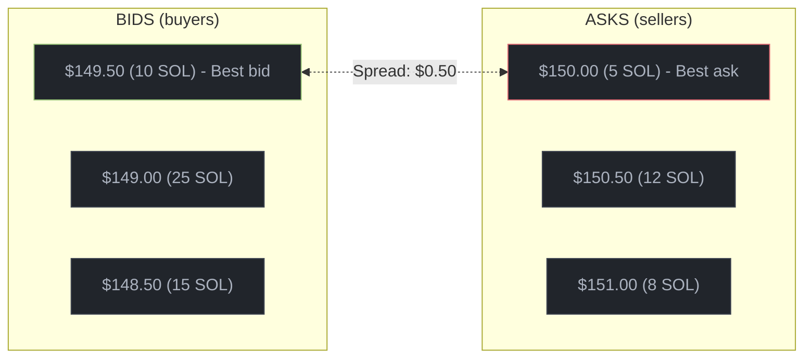
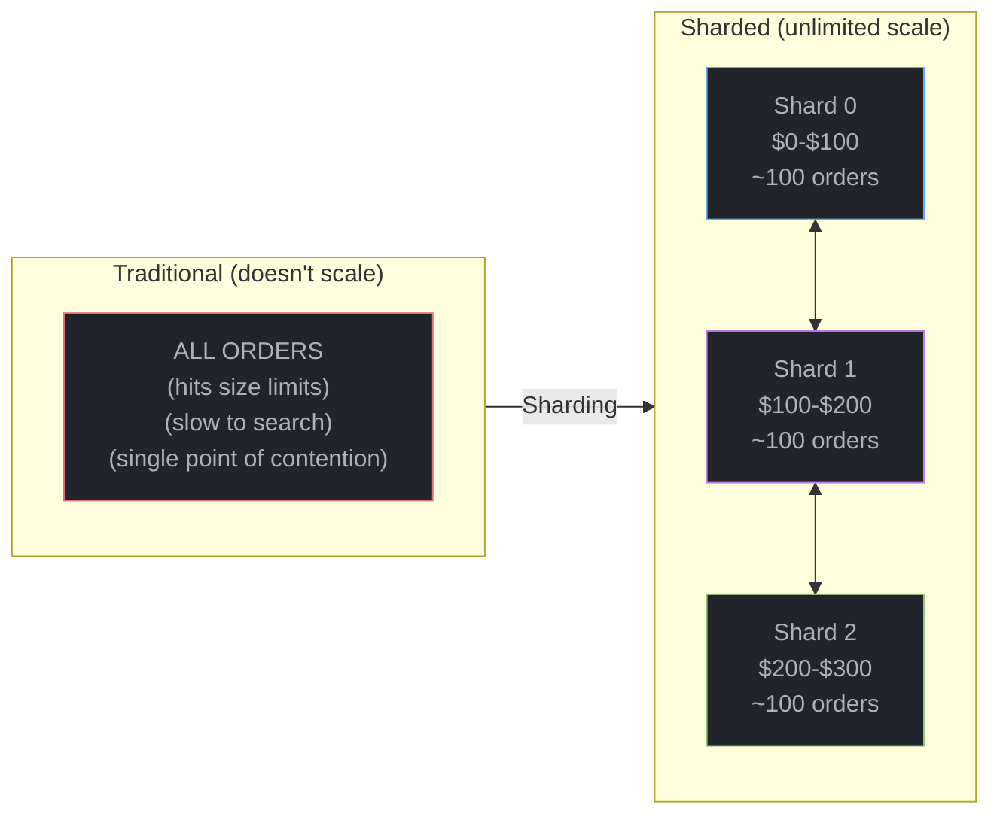
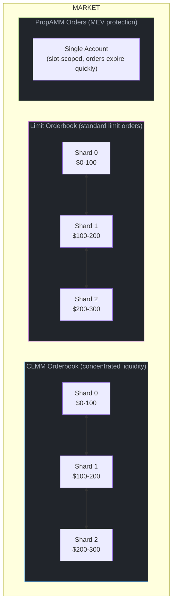
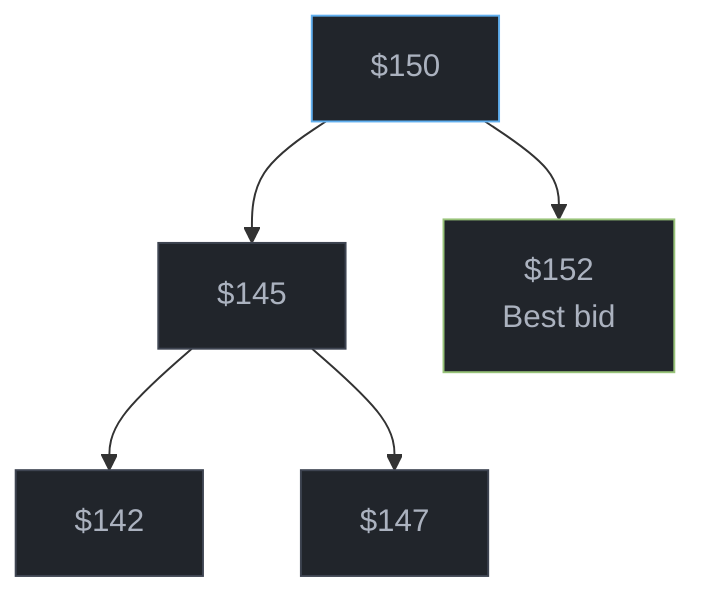
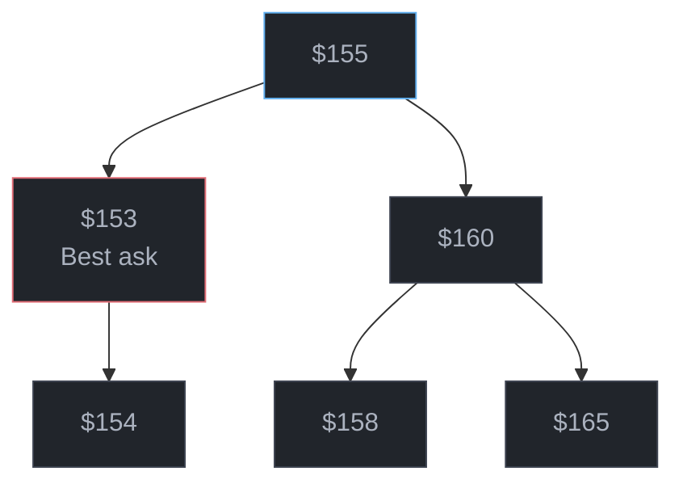
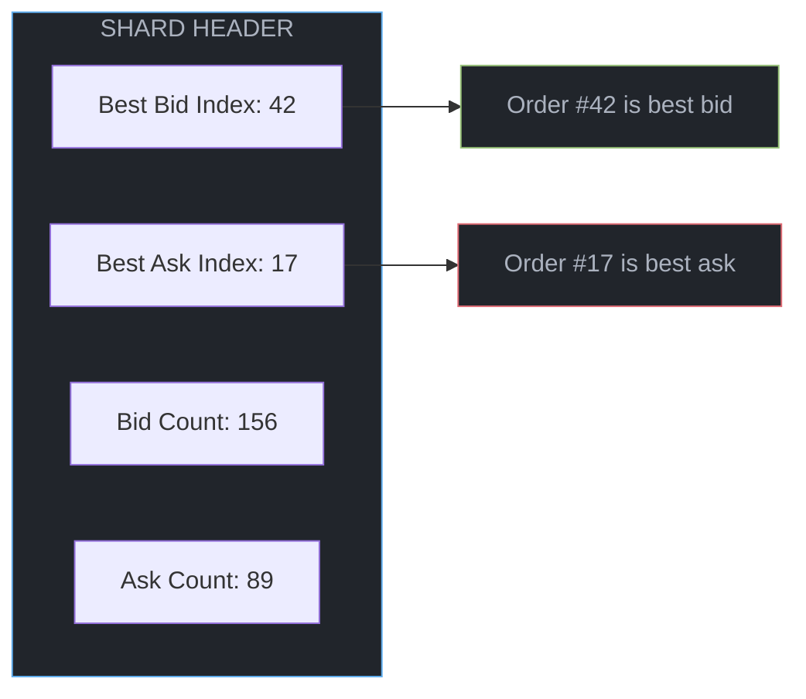
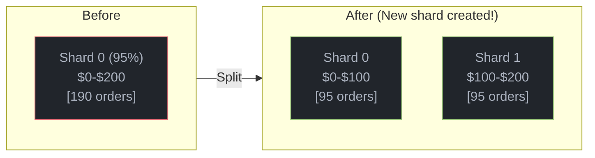
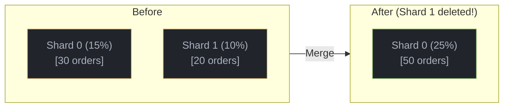
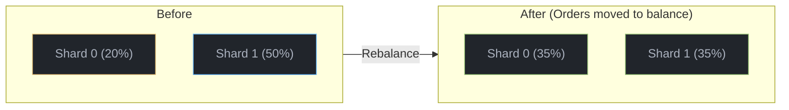

# Orderbook

This page explains how Braid's orderbook works - from the basic concept to the technical implementation details.

## What is an Orderbook?

An orderbook is a list of buy and sell orders organized by price. Think of it like a bulletin board where:

- **Buyers** post how much they'll pay (bids)
- **Sellers** post how much they want (asks)
- **Trades happen** when a buyer's price meets or exceeds a seller's price



The **spread** is the gap between the best bid and best ask ($149.50 to $150.00 = $0.50 spread).

## Why Sharding?

Traditional orderbooks store all orders in one place. This doesn't work on Solana because:

1. **Account size limits**: Solana accounts max out at ~10MB
2. **Compute limits**: Searching thousands of orders costs too many compute units
3. **Concurrent access**: One account means one transaction at a time

**Braid's solution**: Split the orderbook into multiple "shards" by price range.



### Benefits of Sharding

| Benefit | How It Helps |
|---------|-------------|
| **Unlimited orders** | Add more shards as the market grows |
| **Faster searches** | Only look in the relevant price range |
| **Parallel updates** | Different shards can update simultaneously |
| **Lower costs** | Smaller account reads = fewer compute units |

## Orderbook Structure

Each market has three types of orderbooks:



<Note>
**Why isn't PropAMM sharded?** PropAMM orders only live for one slot (~400ms), so they don't accumulate. A single account is enough.
</Note>

## How Orders Are Organized

Within each shard, orders are organized into separate **bid and ask price trees** - data structures that keep prices sorted for fast lookup.

**Bid Tree** (buy orders, sorted descending - best bid is max):



**Ask Tree** (sell orders, sorted ascending - best ask is min):



### Finding the Best Price

Every shard knows its best bid and best ask instantly (O(1) lookup):



No searching required - the shard header caches the answer.

## Automatic Balancing

Shards automatically balance themselves based on how full they are:

### Split (Shard Too Full)

When a shard exceeds 75% capacity and neighbors can't help:



### Merge (Shard Too Empty)

When a shard drops below 25% and its neighbor is also sparse:



### Rebalance (Uneven Shards)

When one shard is sparse but its neighbor has room:



<Note>
**Hysteresis**: There's a 50% buffer between split and merge thresholds to prevent constant splitting/merging when order counts hover around a boundary.
</Note>

## Reading the Orderbook

<Tabs>
  <Tab title="TypeScript">
```typescript
import { Market } from '@braid/client';

// Load the market
const market = new Market(rpc, marketAddress);

// Fetch limit order shards
const limitShards = await market.limitBids.fetchAllShards();
const limitOrderbook = limitShards.toOrderbook();

// Iterate through bids (highest price first)
for (const bid of limitOrderbook.iterateBids()) {
  console.log(`Bid: ${bid.base.amountRemaining} @ ${bid.base.pMin}-${bid.base.pMax}`);
}

// Fetch CLMM order shards
const clmmShards = await market.clmmBids.fetchAllShards();
const clmmOrderbook = clmmShards.toOrderbook();

// Iterate through CLMM positions
for (const position of clmmOrderbook.iterateBids()) {
  console.log(`CLMM: ${position.base.liquidity} liquidity in range`);
}
```
  </Tab>
  <Tab title="Rust">
```rust
use braid_sdk::{Market, LimitOrderbook};

// Load market
let market = Market::new(&rpc, market_address);
let market_data = market.fetch()?;

// Load a specific shard
let shard_data = rpc.get_account_data(&shard_address)?;
let orderbook = LimitOrderbook::new(&shard_data);

// Get best prices
println!("Best bid: {:?}", orderbook.best_bid());
println!("Best ask: {:?}", orderbook.best_ask());

// Iterate bids (best to worst price)
for order in orderbook.bids() {
    println!("BID: {} x {} (owner: {})",
        order.price,
        order.amount,
        order.owner
    );
}

// Iterate asks (best to worst price)
for order in orderbook.asks() {
    println!("ASK: {} x {} (owner: {})",
        order.price,
        order.amount,
        order.owner
    );
}
```
  </Tab>
</Tabs>

---

## Technical Deep Dive

<Accordion title="For Developers: Shard Data Structures">

### Shard Header Structure

Every shard starts with a header containing metadata and tree state:

```rust
struct BaseShardHeader {
    discriminator: [u8; 8],      // Account type identifier
    self_pubkey: Address,        // This shard's address (for validation)
    market: Address,             // Parent market
    market_id: u64,              // Market sequence number

    bids: SideState,             // Bid tree state
    asks: SideState,             // Ask tree state

    capacity: u32,               // Max orders in this shard
    last_updated_at: i64,        // Unix timestamp
    next_order_id: u64,          // Auto-increment for new orders

    next_bids_shard: Address,    // Toward lower prices (worse bids)
    next_asks_shard: Address,    // Toward higher prices (worse asks)

    min_price: u64,              // Lower price bound (inclusive)
    max_price: u64,              // Upper price bound (exclusive)

    shard_flags: u8,             // Status flags (migrating, etc.)
    bump: u8,                    // PDA bump seed
}
```

### Side State (Per-Side Tracking)

Each side (bids/asks) maintains:

```rust
struct SideState {
    price_tree: TreeState,       // Red-black tree for price ordering
    count: u32,                  // Number of orders
    free_head: u32,              // Free list for reusing slots
    next_slot: u32,              // Next available slot index
}

struct TreeState {
    root: u32,                   // Root node index
    min_idx: u32,                // Best price (cached for O(1))
    max_idx: u32,                // Worst price (cached for O(1))
}
```

### Order Structure (Limit Orders)

```rust
struct LimitOrder {
    // Base order fields
    owner: Address,              // Order owner
    amount: u64,                 // Remaining amount
    filled_amount: u64,          // Amount already filled
    price: u64,                  // Limit price

    // Tree node (embedded - no separate index accounts)
    left: u32,                   // Left child index
    right: u32,                  // Right child index
    parent: u32,                 // Parent index
    color: u8,                   // Red (0) or Black (1)

    // Metadata
    created_at: i64,             // Unix timestamp
    expires_at: i64,             // 0 = never expires
    order_id: u64,               // Unique ID within shard
    side: u8,                    // 0 = bid, 1 = ask
}
```

### Index Scheme

Orders use a simple odd/even scheme for indexing:

| Index | Side | Example |
|-------|------|---------|
| 1, 3, 5, 7, ... | Bids | Order slot 1 is a bid |
| 2, 4, 6, 8, ... | Asks | Order slot 2 is an ask |
| u32::MAX | NULL | Empty/null sentinel |

This allows instant side identification: `is_bid = (idx % 2 == 1)`.

### PDA Seeds

```rust
// Shard addresses are derived from:
["clmm_orders", market_pubkey, shard_idx.to_le_bytes()]
["limit_orders", market_pubkey, shard_idx.to_le_bytes()]
["prop_amm_orders", market_pubkey]  // No shard_idx (single account)
```

### Shard Balancing Thresholds

| Threshold | Condition | Action | Why |
|-----------|-----------|--------|-----|
| 75% | Shard full, neighbors full | Split | Create capacity |
| 25% | Shard sparse, neighbor sparse | Merge | Reclaim rent |
| 25% | Shard sparse, neighbor has room | Rebalance | Even distribution |
| 50% gap | Between split/merge | Hysteresis | Prevent thrashing |

</Accordion>

<Accordion title="For Developers: Performance Characteristics">

### Time Complexity

| Operation | Complexity | Notes |
|-----------|------------|-------|
| Best bid/ask | O(1) | Cached in header |
| Place order | O(log n) | Tree insertion |
| Cancel order | O(log n) | Tree deletion |
| Fill order | O(1) | Direct index access |
| Find shard for price | O(s) | s = number of shards, usually &lt;10 |

### Space Complexity

| Component | Size | Notes |
|-----------|------|-------|
| Shard header | ~500 bytes | Fixed overhead per shard |
| Limit order | 88 bytes | Including tree node |
| CLMM order | 96 bytes | Including density curve data |
| PropAMM order | 104 bytes | Including slot data |
| Typical shard | ~10KB | ~100 orders per shard |

### Compute Units (CU)

| Operation | Typical CU | Notes |
|-----------|------------|-------|
| Load shard | ~5,000 | Deserialization |
| Place order | ~15,000 | With tree rebalance |
| Cancel order | ~12,000 | With tree rebalance |
| Take (per fill) | ~8,000 | Per order touched |
| Shard split | ~50,000 | Heavy operation (cranked) |

</Accordion>
