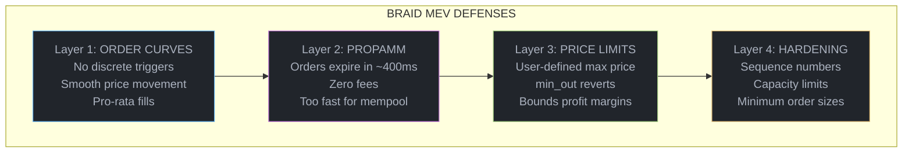

# Security & MEV Protection

Braid is designed from the ground up to minimize MEV (Maximal Extractable Value) - the value that can be extracted by reordering, inserting, or censoring transactions. This page explains the threats and Braid's defenses.

---

## Understanding MEV

MEV refers to the profit that can be extracted by manipulating transaction ordering. On most DEXs, sophisticated bots exploit regular traders.

### The Most Common Attacks

<Tabs>
  <Tab title="Front-Running">
```
THE ATTACK:
────────────────────────────────────────────────────
1. You submit: "Buy 100 SOL at market"
2. Bot sees your pending tx in mempool
3. Bot front-runs: Buys SOL first (pushes price up)
4. Your tx executes at higher price
5. Bot profits from price difference

EXAMPLE:
  You expected: Buy 100 SOL @ $150 = $15,000
  Bot buys:     50 SOL @ $150 = $7,500
  Price moves:  $150 → $152
  You actually: Buy 100 SOL @ $152 = $15,200
  Bot sells:    50 SOL @ $152 = $7,600
  Bot profit:   $100 (you lost $200)
```
  </Tab>
  <Tab title="Sandwich Attack">
```
THE ATTACK (double-sided):
────────────────────────────────────────────────────
1. Bot sees your buy order
2. Bot front-runs: Buys before you
3. Your tx executes (pushes price higher)
4. Bot back-runs: Sells immediately after you

EXAMPLE:
  Initial price: $150
  Bot buys:      100 SOL @ $150
  Price:         $150 → $152
  You buy:       100 SOL @ $152
  Price:         $152 → $154
  Bot sells:     100 SOL @ $154
  Bot profit:    $400 (from both directions)

You are the "meat" in the sandwich.
```
  </Tab>
  <Tab title="Just-In-Time Liquidity">
```
THE ATTACK:
────────────────────────────────────────────────────
1. Bot sees your large swap coming
2. Bot adds liquidity just before your tx
3. Your swap fills against bot's liquidity
4. Bot removes liquidity right after

RESULT:
  Bot captures trading fees meant for real LPs
  No actual liquidity provision occurs
  Just profitable arbitrage disguised as LP

This is technically "providing service" but extracts
value from legitimate liquidity providers.
```
  </Tab>
</Tabs>

---

## Braid's Defense Layers

Braid employs multiple defense mechanisms that work together:



---

## Layer 1: Order Curves Eliminate Trigger Points

Traditional orderbooks have discrete orders at specific prices. Each price level is a "trigger point" that bots can exploit:

```
TRADITIONAL ORDERBOOK               BRAID ORDER CURVES
(Discrete triggers)                 (Continuous liquidity)

       ▲                                  ▲
$155   │ ████ (trigger)                   │      ╭──────╮
$154   │ ██████ (trigger)                 │    ╱        ╲
$153   │ ████████ (trigger)    vs.        │  ╱            ╲
$152   │ ██████████ (trigger)             │╱                ╲
$151   │ ████████████ (trigger)           └──────────────────▶
       └──────────────────▶               $145            $160

Each trigger = arbitrage opportunity     No triggers = no easy arbitrage
Bot waits for price to hit trigger       Price moves smoothly
```

### Why Continuous Curves Matter

**Discrete Order Problem:**
```
Bot strategy: "When price hits $152, the 10 SOL order triggers.
              I'll buy at $151.99, let the order trigger,
              then sell at $152.01 for guaranteed profit."
```

**Continuous Curve Solution:**
```
No discrete trigger exists. Price is a function of fill amount.
To move price from $151 to $152, bot must buy continuously.
Each fraction of a cent costs real money - no free triggers.
```

### Pro-Rata Matching

When multiple orders exist at the same price, fills are distributed proportionally:

```
Two CLMM orders at price $150:
  Order A: 1000 SOL liquidity
  Order B: 500 SOL liquidity

Incoming buy of 150 SOL:
  Order A gets: 150 × (1000/1500) = 100 SOL
  Order B gets: 150 × (500/1500) = 50 SOL
```

This eliminates the "race to be first" that incentivizes latency competition and MEV extraction.

---

## Layer 2: PropAMM Slot-Scoped Orders

PropAMM orders are Braid's most powerful MEV defense. They're only valid for a single Solana slot (~400ms).

### How Slot-Scoping Protects You

```
Timeline of a PropAMM order:

Slot N-1     Slot N              Slot N+1
   │           │                    │
   │           ├─ Order placed      │
   │           │                    │
   │           ├─ Valid: ~400ms     ├─ Order EXPIRED
   │           │  (too fast for     │  (unfillable)
   │           │   mempool bots)    │
   │           │                    │
   ▼           ▼                    ▼

Bot would need to:
1. See your tx in mempool
2. Analyze profitability
3. Construct attack tx
4. Get attack tx included

All in &lt;400ms? Nearly impossible.
```

### Zero Fees for PropAMM

PropAMM orders have **zero trading fees** to incentivize their use:

```rust
// Fee calculation for PropAMM
prop_amm_fee = 0;  // No base fee, no slot fee

// Compare to other order types:
clmm_fee      = fill_amount * clmm_fee_bps / 10000;    // e.g., 30 bps
limit_fee     = fill_amount * limit_fee_bps / 10000;   // e.g., 10 bps
```

The rationale: orders that can't be exploited don't need fee compensation for MEV risk.

### Slot Restart Protection

After a Solana cluster restart, PropAMM is temporarily disabled to prevent stale orders from being exploited:

```rust
// Safety check in matching engine
const RESTART_PROTECTION_SLOTS: u64 = 10;

fn should_include_prop_amm(current_slot: u64, restart_slot: u64) -> bool {
    current_slot - restart_slot > RESTART_PROTECTION_SLOTS
}
```

---

## Layer 3: Price Limits & Slippage Protection

Every swap can specify limits that bound potential losses:

### limitPrice: Maximum Acceptable Price

```typescript
// Will not fill any orders priced above $155
await Market.swapIx({
  side: Side.Ask,          // Buying SOL
  amount: 100_000_000n,    // 100 USDC
  limitPrice: 155_000_000n, // Won't pay more than $155/SOL
  minOut: 0n,
});
```

If an attacker pushes the price above $155, the transaction simply stops filling rather than executing at a bad price.

### minOut: Minimum Acceptable Output

```typescript
// Will revert if output less than 0.64 SOL
await Market.swapIx({
  side: Side.Ask,
  amount: 100_000_000n,
  limitPrice: 0n,
  minOut: 640_000_000n,    // At least 0.64 SOL or revert
});
```

This provides "all or nothing" protection - if the trade isn't good enough, it doesn't happen.

### Combined Protection

```typescript
// Best practice: use both
await Market.swapIx({
  side: Side.Ask,
  amount: 100_000_000n,
  limitPrice: 155_000_000n,  // Price cap
  minOut: 640_000_000n,      // Output floor
});
```

---

## Layer 4: Architectural Security

Beyond MEV, Braid has hardened security at the protocol level.

### Sequence Numbers

Every order has a sequence number that prevents replay and stale cancellation attacks:

```rust
pub struct BaseOrder {
    // ... other fields
    pub sequence_num: u64,  // Monotonically increasing
}

fn should_accept_update(order: &BaseOrder, incoming_seq: u64) -> bool {
    // Only accept if newer OR explicit reset (seq = 0)
    incoming_seq > order.sequence_num || incoming_seq == 0
}
```

**Attack prevented:**
```
1. User places order (seq=1)
2. User cancels order (seq=2)
3. Attacker replays old cancel (seq=1)
4. REJECTED: seq=1 < current seq=2
```

### Capacity-Based Eviction

When orderbooks reach capacity, the smallest orders are evicted:

```
Attack: Spam thousands of tiny orders to DoS the book

Defense: Size-augmented tree tracks smallest orders
         When capacity hit, smallest orders evicted
         Legitimate orders survive, spam disappears

Mechanism:
  - RB-tree with max_size_in_subtree annotation
  - O(log n) lookup of smallest order
  - Eviction runs automatically on place
```

### Minimum Order Thresholds

The matching engine can skip dust orders:

```rust
// Skip orders smaller than 0.2% of remaining swap
const MIN_OUTPUT_BIPS: u16 = 20;

fn should_fill_order(order: &Order, remaining: u64) -> bool {
    order.amount >= remaining * MIN_OUTPUT_BIPS / 10000
}
```

**Attack prevented:**
```
1. Attacker places 1000 orders of 0.0001 SOL each
2. Your swap attempts to fill them
3. Each fill: order_amount < 0.2% of swap_amount
4. Orders skipped (capped at MAX_SKIPS = 32)
5. Real orders filled instead
```

### Account Ownership Validation

All writable accounts are validated against expected ownership:

```rust
fn validate_accounts(accounts: &[AccountInfo], program_id: &Pubkey) -> Result<()> {
    for account in accounts.iter().filter(|a| a.is_writable) {
        require!(
            account.owner == program_id || account.owner == &spl_token::ID,
            ErrorCode::InvalidOwner
        );
    }
    Ok(())
}
```

---

## Security Best Practices

<Steps>
  <Step title="Use PropAMM for Large Trades">
    For trades over $10,000, PropAMM's slot-scoping provides the strongest protection.
  </Step>
  <Step title="Always Set minOut">
    Calculate expected output and set `minOut` to ~99% of that (allowing 1% slippage).
  </Step>
  <Step title="Use Private Submission">
    Submit PropAMM transactions through Jito bundles or similar private channels for maximum protection.
  </Step>
  <Step title="Avoid Pending Transactions">
    Don't leave large market orders pending. If a transaction takes too long, it may be targeted.
  </Step>
</Steps>

---

## Attack Resistance Summary

| Attack Type | Traditional DEX | Braid |
|-------------|-----------------|-------|
| Front-running | Vulnerable | **Protected** (PropAMM, continuous curves) |
| Sandwich | Vulnerable | **Protected** (slot-scoping, minOut) |
| JIT Liquidity | Vulnerable | **Resistant** (pro-rata matching) |
| Order Spam | Often vulnerable | **Protected** (capacity eviction) |
| Replay Attack | Varies | **Protected** (sequence numbers) |
| Dust Griefing | Often vulnerable | **Protected** (min order bips) |

---

## Technical Deep Dive

<Accordion title="Signer Deduplication (PropAMM)">

PropAMM uses a signer field to handle the case where the same wallet has orders in both current and previous slots:

```rust
pub struct PropAmmOrder {
    pub base: BaseOrder,
    pub signer: Address,        // 32 bytes - order placer
    pub placed_slot: u64,       // 8 bytes - for shadowing
    // ...
}
```

When matching:
```rust
fn get_effective_order(signer: &Address, current_slot: u64) -> Option<&PropAmmOrder> {
    let current = orders.get_by_signer_slot(signer, current_slot);
    let previous = orders.get_by_signer_slot(signer, current_slot - 1);

    // Current slot order shadows previous
    current.or(previous)
}
```

This prevents a form of slot arbitrage where users could have conflicting orders across slots.

</Accordion>

<Accordion title="Interleaved Slot Index">

PropAMM uses an interleaved index scheme for O(1) slot rotation:

```rust
// Slot indices based on position mod 4
slots[0]: indices 1,2,5,6,9,10,...   (mod 4 ∈ [1,2])
slots[1]: indices 3,4,7,8,11,12,...  (mod 4 ∈ [3,0])

// When Solana slot advances:
fn on_slot_advance(&mut self) {
    // Swap which is "current" vs "last"
    self.current_slot_idx = 1 - self.current_slot_idx;

    // Clear what is now "current" (was "last" before)
    self.clear_slot(self.current_slot_idx);
}
```

Benefits:
- No data movement needed on slot rotation
- Just swap pointers and clear
- O(1) overhead per slot

</Accordion>

<Accordion title="Discriminator Verification">

Every account has an 8-byte discriminator checked on load:

```rust
enum AccountType {
    Market = 0,
    ClmmOrders = 1,
    LimitOrders = 2,
    PropAmmOrders = 3,
    Protocol = 4,
    // ...
}

fn verify_account(account: &AccountInfo, expected: AccountType) -> Result<()> {
    let data = account.try_borrow_data()?;
    let discriminator = data[0];

    require!(
        discriminator == expected as u8,
        ErrorCode::InvalidDiscriminator
    );

    Ok(())
}
```

This prevents account substitution attacks where an attacker tries to pass a different account type.

</Accordion>

---

## Further Reading

<CardGroup cols={2}>
  <Card title="PropAMM Orders" icon="bolt" href="/orders/prop-amm-orders">
    Detailed guide to using MEV-protected orders
  </Card>
  <Card title="Matching Engine" icon="gears" href="/concepts/matching-engine">
    How the matching algorithm maintains security invariants
  </Card>
</CardGroup>
