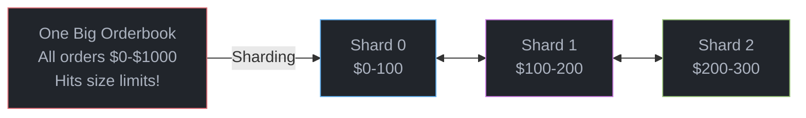
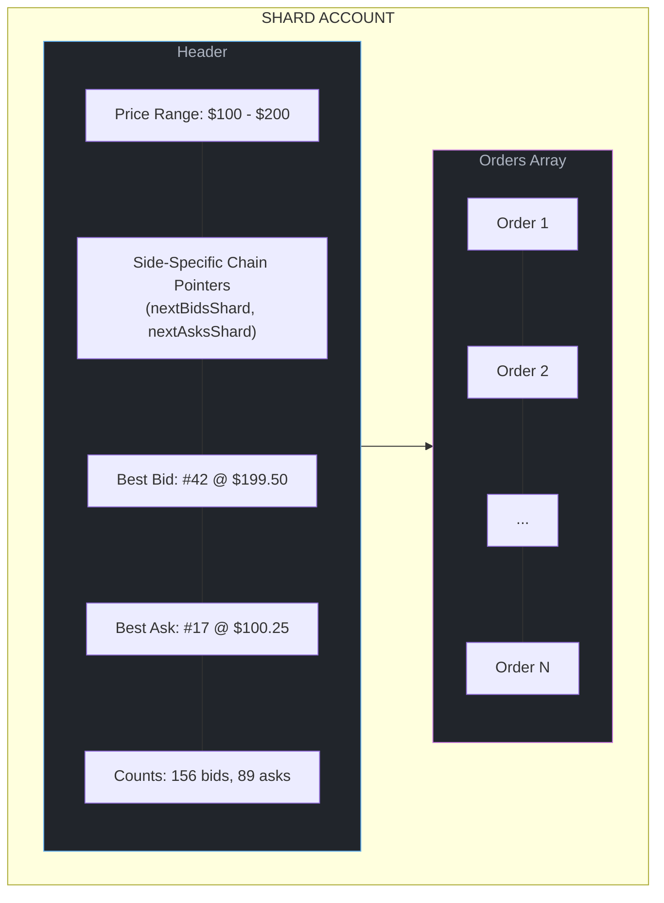
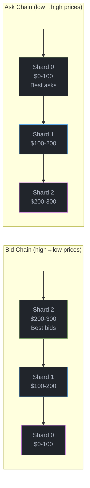
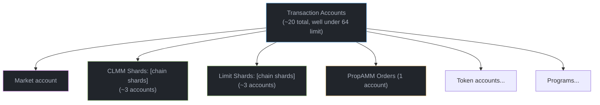
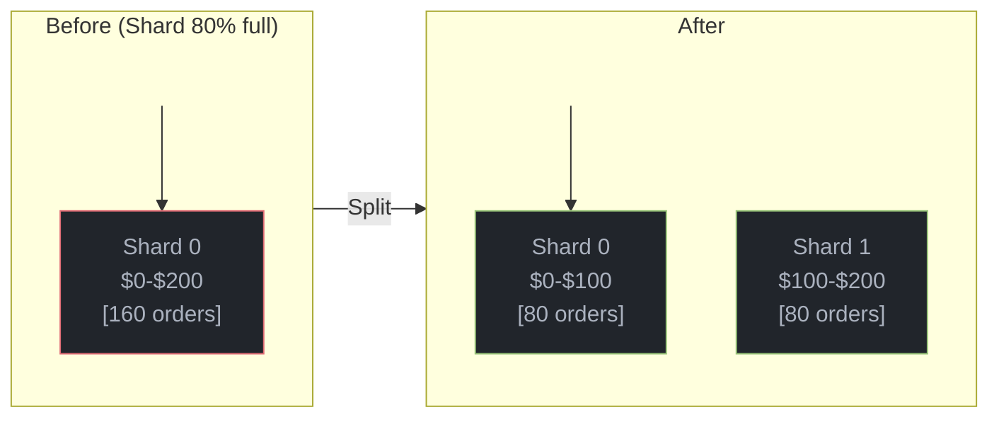
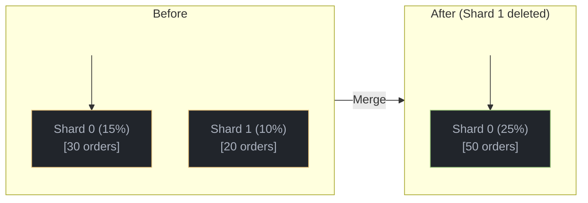
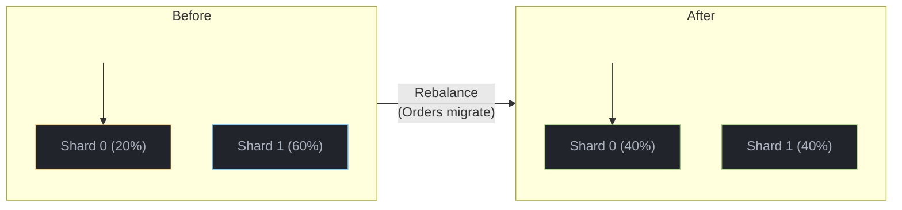
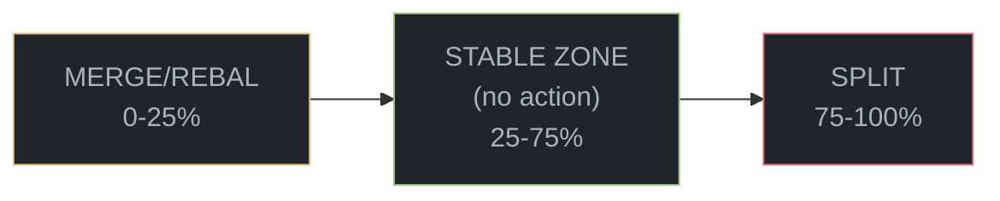

# Sharding

Sharding is the key innovation that allows Braid to scale beyond the limits of a single Solana account. This page explains why sharding is necessary, how it works, and what happens behind the scenes.

## The Problem: Blockchain Limits

Imagine trying to run the New York Stock Exchange on a single spreadsheet. That spreadsheet would need to hold millions of orders, update instantly, and never crash. That's essentially what on-chain orderbooks face on Solana.

### Solana's Constraints

| Constraint | Limit | What It Means |
|------------|-------|---------------|
| **Account size** | 10 MB | A single account can hold ~100,000 orders max |
| **Transaction accounts** | 64 | A transaction can only read/write 64 accounts |
| **Compute units** | 1.4M per tx | Complex operations can run out of "gas" |
| **Lock contention** | 1 writer | Only one transaction can modify an account at a time |

A busy market like SOL/USDC might need to handle millions of orders across thousands of price levels. A single account simply can't do this.

## The Solution: Sharding

Instead of one giant orderbook, Braid splits orders across multiple accounts called "shards", each covering a specific price range:



### How It Helps

| Problem | How Sharding Solves It |
|---------|------------------------|
| **Size limits** | Each shard is small (~10KB), add more as needed |
| **Account limits** | Only load shards you need (usually 3-6) |
| **Compute limits** | Smaller data = faster processing |
| **Lock contention** | Different price ranges can update in parallel |

## Real-World Analogy

Think of sharding like filing cabinets for invoices:

- **Without sharding**: All invoices in one massive drawer. Finding invoices for $100-$200 means flipping through thousands of documents.
- **With sharding**: Separate drawers labeled by amount range. The "$100-$200" drawer only has invoices in that range.

When you place an order at $150, Braid knows exactly which "drawer" (shard) to put it in. When filling orders, it only opens the drawers containing relevant prices.

## Shard Structure

Each shard is a Solana account containing:



### Side-Specific Shard Chains

Shards use **side-specific navigation** - each side (bids/asks) has its own traversal chain:

- **nextBidsShard**: Points toward lower prices (worse bids)
- **nextAsksShard**: Points toward higher prices (worse asks)

This allows efficient traversal from best price outward for each side:



<Note>
**Same shards, different chains**: The same physical shards are traversed in different directions depending on whether you're matching bids or asks. The bid head and ask head may even point to the same shard in tight markets.
</Note>

## How Trades Work With Shards

When you execute a swap, the matching engine needs to find the best prices. Here's how:

### Step 1: Build the Transaction

The transaction includes only the relevant shards (usually 3 per orderbook type):



### Step 2: Match Across Shards

The matching engine finds the best price across all loaded shards:

```
Query best prices:
  CLMM Shard 1: Best ask = $150.05
  Limit Shard 1: Best ask = $150.12
  PropAMM: Best ask = $150.08

Winner: CLMM @ $150.05 → Fill from CLMM first
```

## Automatic Balancing

Shards automatically grow, shrink, split, and merge based on how many orders they contain. This happens via "crank" transactions that anyone can submit.

### Split: When a Shard Gets Too Full

When a shard exceeds **75% capacity** and its neighbors are also full:



High-price orders migrate to the new shard.

### Merge: When Two Shards Are Too Empty

When two adjacent shards are both below **25% capacity**:



### Rebalance: When Shards Are Uneven

When one shard is sparse but its neighbor has room:



## Hysteresis: Preventing Thrashing

What if a shard has exactly 75% orders? Should it split? What if someone then cancels an order - should it immediately merge?

To prevent constant splitting and merging, Braid uses **hysteresis** - a buffer zone where no action is taken:



The 50% gap (25% to 75%) means:
- A shard at 30% won't split, then immediately merge
- A shard at 70% won't merge, then immediately split
- Normal order flow doesn't trigger constant rebalancing

---

## Technical Deep Dive

<Accordion title="PDA Seeds and Addressing">

Shard accounts are Program Derived Addresses (PDAs):

```rust
// CLMM shard seeds
["clmm_orders", market_pubkey, shard_idx.to_le_bytes()]

// Limit shard seeds
["limit_orders", market_pubkey, shard_idx.to_le_bytes()]

// PropAMM (not sharded)
["prop_amm_orders", market_pubkey]
```

### Finding Shards

To find all shards for a market:

```typescript
// Option 1: Load from market config
const market = await Market.load(connection, marketAddress);
const clmmShards = market.clmmShardManager; // Contains shard addresses

// Option 2: Derive programmatically
import { PublicKey } from '@solana/web3.js';

function deriveClmmShard(market: PublicKey, shardIdx: number): PublicKey {
  const [shard] = PublicKey.findProgramAddressSync(
    [
      Buffer.from('clmm_orders'),
      market.toBuffer(),
      Buffer.from(new Uint8Array(new BigUint64Array([BigInt(shardIdx)]).buffer))
    ],
    BRAID_PROGRAM_ID
  );
  return shard;
}
```

</Accordion>

<Accordion title="Shard Manager State">

The Market account contains a ShardManager that tracks all shards:

```rust
struct ShardManager {
    // Head of bid chain (highest prices - best bids)
    bid_head: Address,

    // Head of ask chain (lowest prices - best asks)
    ask_head: Address,

    // Total number of shards
    shard_count: u32,

    // Next shard index to use when creating
    next_shard_idx: u64,
}
```

This allows O(1) lookup of:
- Where to start for best bids (bid_head) or best asks (ask_head)
- How many shards exist
- Index for creating new shards

</Accordion>

<Accordion title="Crank Instructions">

Shard rebalancing is triggered by permissionless "crank" instructions:

| Instruction | When to Call |
|-------------|--------------|
| `CrankSplit` | Shard >75% full |
| `CrankMerge` | Adjacent shards &lt;25% each |
| `CrankRebalance` | One shard &lt;25%, neighbor has room |

### Example: Calling CrankSplit

```typescript
// Anyone can call this - it's permissionless
const tx = await market.crankSplit({
  sourceShard: overloadedShardAddress,
});

await sendAndConfirmTransaction(connection, tx, [payer]);
```

</Accordion>

