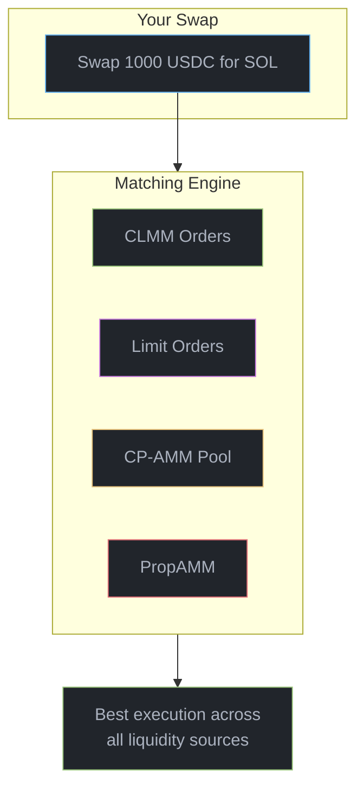
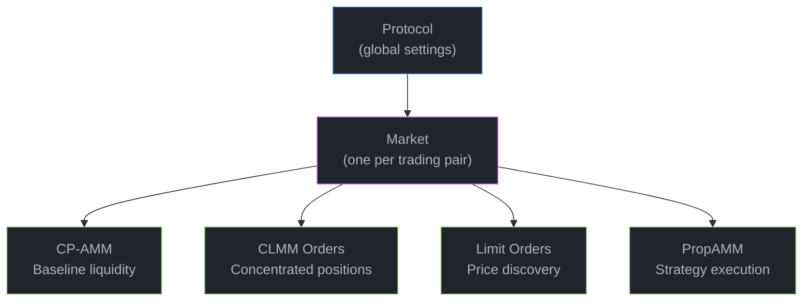
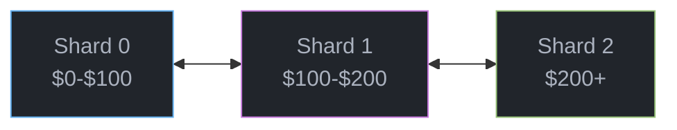

# Don't just trade. Braid.

Braid is a new financial primitive: **limit orders that act across a price range**, not just a single price point.

<Note title="Sound familiar?">
Your favorite crypto project is launching a major feature tomorrow. You're confident the price will rise—you just don't know by how much. You place a limit order expecting a 10% pump... but it only goes up 9%. Your order never fills. You watched the rally from the sidelines.

**With density orders, you could have set a range from 5% to 15%—and captured the move.**
</Note>

## The Problem with Traditional Orders

When you want to buy a token, you rarely think in terms of a single price:

*"I want to buy a little if it dips to 95, but a lot more if it drops to 90."*

Today, expressing this intent requires manually placing dozens of orders at different prices - tedious, gas-intensive, and error-prone. Most traders give up and either:
- Place a single limit order (missing opportunities)
- Market buy everything at once (getting worse prices)

## Density Orders: Your Intent, One Order

Braid introduces **density orders** - specify a price range and a distribution curve, and Braid handles the rest:

```
Buy SOL from $140 to $130
├─ At $140: Buy with 10% of capital
├─ At $135: Buy with 30% of capital
└─ At $130: Buy with 60% of capital
```

One order. One transaction. Your full trading intent expressed on-chain.

## Real-World Use Cases

<CardGroup cols={2}>
  <Card title="Smart Accumulation" icon="chart-line-down">
    Buy more as prices fall - automatic DCA that responds to market conditions, not arbitrary time intervals.
  </Card>
  <Card title="Graduated Profit-Taking" icon="chart-line-up">
    Sell progressively as prices rise. Capture gains without trying to time the exact top.
  </Card>
  <Card title="Portfolio Rebalancing" icon="scale-balanced">
    Rebalance gradually as prices move. Earn spread instead of paying it.
  </Card>
  <Card title="Liquidity Provision" icon="droplet">
    Provide two-sided liquidity with linked buy/sell ranges. Market make without active management.
  </Card>
</CardGroup>

## Think Like a Market Maker

Professional market makers don't think about single prices - they think about curves:

| Concept | What It Means | How Braid Helps |
|---------|---------------|-----------------|
| **Spread** | Gap between buy and sell prices | Define your own spread with density order ranges |
| **Depth** | How much liquidity at each price level | Shape your liquidity curve across any range |
| **Gamma** | How fast you accumulate inventory | Control your exposure curve as prices move |

With Braid, retail traders get the same expressive power that professional market makers have always had - without the infrastructure, capital requirements, or complexity.

## PropAMM: Launch Your Strategy

Braid isn't just for traders. **PropAMM** lets anyone deploy automated trading strategies on-chain:

- **Zero fees** for PropAMM orders
- **MEV-resistant** execution (slot-scoped orders)
- **Fully on-chain** - no servers, no custody risk

Whether you're building a rebalancing bot, a yield optimizer, or a novel AMM curve - PropAMM gives you the primitives to launch it.

## Unified Liquidity for Token Launches

New tokens face an impossible choice:

| Approach | Pros | Cons |
|----------|------|------|
| **Constant Product AMM** | Simple, always liquid | Capital inefficient, high slippage |
| **Concentrated Liquidity** | Better capital efficiency | Complex, requires active management |

Choosing one means fragmenting liquidity. Braid solves this by **combining both in one venue**:

- Constant-product AMM for baseline liquidity
- Concentrated liquidity positions for capital efficiency
- Limit orders for price discovery
- All routed through a single matching engine

**One pool. All liquidity types. No fragmentation.**

---

## The Key Innovation: Density Orders

Every order type in Braid - whether Limit, CLMM, or PropAMM - is powered by the same underlying primitive: **density orders**.

A density order defines:
- **Price range**: The bounds where your order is active (`pMin` to `pMax`)
- **Distribution curve**: How your liquidity is allocated within that range

This single abstraction replaces the patchwork of different order types found in traditional exchanges:

| Traditional | Braid Density Order |
|-------------|---------------------|
| Limit order at $100 | Range $100-$100, uniform curve |
| Concentrated LP $90-$110 | Range $90-$110, uniform curve |
| Graduated buy ladder | Range $80-$100, linear curve |
| Custom AMM curve | Range + custom density function |

**One primitive. Infinite expressiveness.** Whether you're placing a simple limit order or deploying a sophisticated market-making strategy, you're using the same underlying mechanism - just with different parameters.

This unification isn't just elegant - it enables Braid's matching engine to efficiently route trades across all liquidity sources, finding the best execution without the fragmentation that plagues multi-venue markets.

---

## How It Works

When you swap on Braid, the matching engine finds the best prices across all sources:



## Architecture at a Glance



## Get Started

<CardGroup cols={3}>
  <Card title="Quickstart" icon="rocket" href="/quickstart">
    Your first trade in 5 minutes
  </Card>
  <Card title="TypeScript SDK" icon="js" href="/sdk/typescript/installation">
    Build trading applications
  </Card>
  <Card title="Architecture" icon="sitemap" href="/architecture">
    Technical deep dive
  </Card>
</CardGroup>

---

## Technical Deep Dive

<Accordion title="For Developers: Key Technical Details">

### Sharded Orderbooks

Traditional on-chain orderbooks hit Solana's account size limits. Braid shards orders by price range:



- **Unlimited orders**: Add shards as needed
- **Fast lookups**: Only search relevant price ranges
- **Parallel processing**: Multiple shards update simultaneously

### Account Structure

| Account Type | Count | Description |
|--------------|-------|-------------|
| Market | 1 | Market config, fee settings, shard managers |
| CP-AMM Vaults | 2 | Token reserves for constant-product AMM |
| ClmmOrders | Variable | Sharded CLMM orders by price range |
| LimitOrders | Variable | Sharded limit orders by price range |
| PropAmmOrders | 1 | Slot-scoped orders (not sharded) |

### Fee Structure

| Fee Type | Applied To | Typical Range |
|----------|------------|---------------|
| CLMM Fee | CLMM order fills | 1-30 bps |
| Limit Fee | Limit order fills | 1-10 bps |
| PropAMM Fee | PropAMM orders | **0 bps** |
| Protocol Fee | All trades | 1-5 bps |

### PDA Seeds

```rust
// Market
["market", mint_a, mint_b, seed]

// Orderbook shards
["clmm_orders", market, shard_idx]
["limit_orders", market, shard_idx]
["prop_amm_orders", market]

// User tracking
["user", owner]
["user_orders_header", owner, market]
```

</Accordion>
