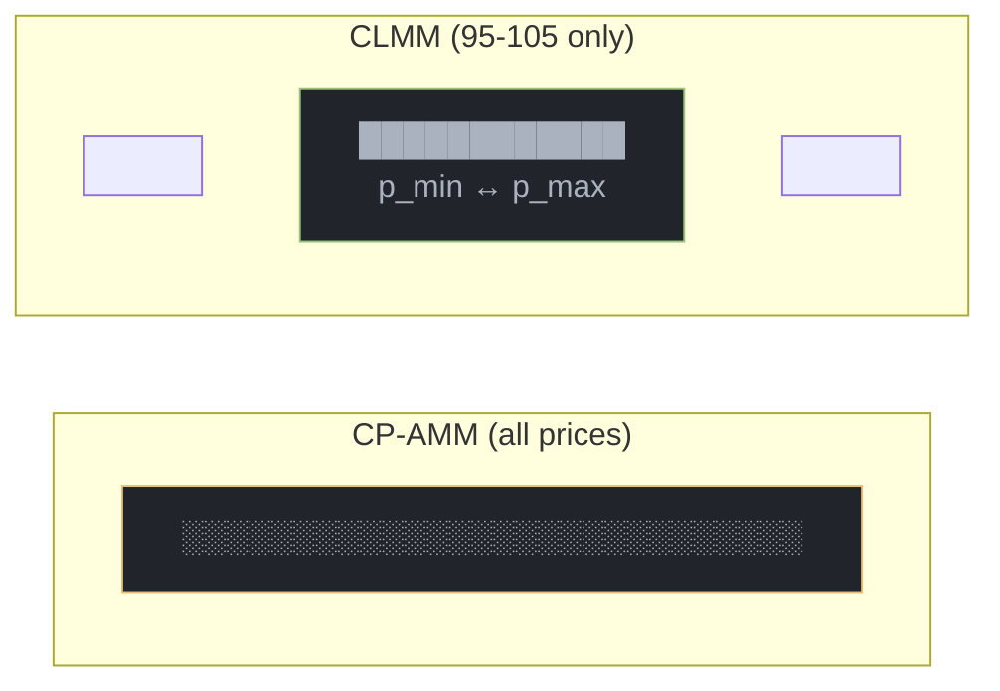

# Concentrated Liquidity

CLMM orders provide concentrated liquidity within specific price ranges for capital-efficient market making.

## How It Works

Instead of providing liquidity across all prices (like CP-AMM), CLMM concentrates liquidity in a range:



## Benefits

| Metric | CP-AMM | CLMM |
|--------|--------|------|
| Capital efficiency | 1x | Up to 100x+ |
| Active management | None | Required |
| Impermanent loss | Lower | Higher (in range) |
| Fee earning | Always | Only in range |

## Density Curves

CLMM orders use power-law density:

```
d(t) = n * t^(n-1)
```

This allows customizing how liquidity is distributed across the range.

## Paired Orders

See [CLMM Orders](/orders/clmm-orders) for details on how paired bid/ask orders work.
