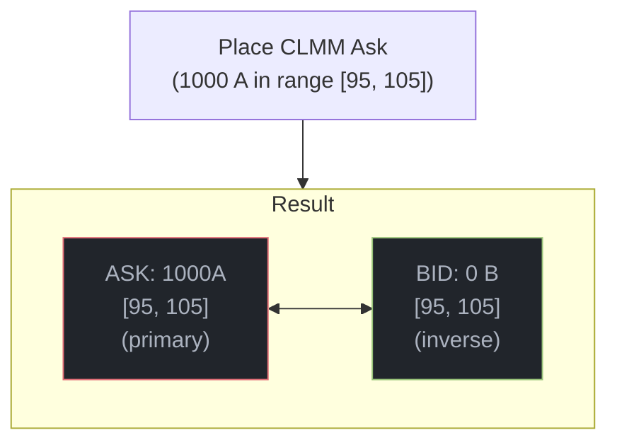
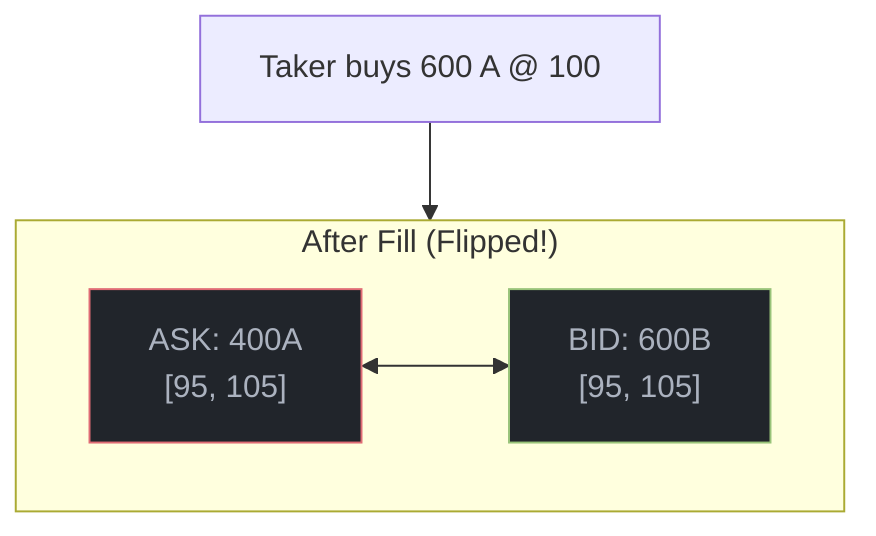

# CLMM Orders

Concentrated Liquidity Market Maker orders provide liquidity across a price range with power-law density curves.

## Key Concept: Paired Orders

Every CLMM order creates a **bid+ask pair**:



When filled, liquidity **flips** to the inverse:



## Place Position

```typescript
const tx = await placeClmmPosition({
  market: marketAddress,
  side: Side.Ask,
  pMin: 95_000_000n,
  pMax: 105_000_000n,
  amount: 10_000_000n,
  owner: wallet.publicKey,
});
```

## Cancel Position

Cancelling removes **both** the primary and inverse orders:

```typescript
const tx = await cancelClmmPosition({
  market: marketAddress,
  orderIdx: 42,
  side: Side.Ask,
  owner: wallet.publicKey,
});
// Refunds from both vaults (A and B)
```

## Power-Law Density

CLMM orders use power-law density curves:

```
d(t) = n * t^(n-1)
```

Where `t` is normalized position in the price range [0, 1].

| Exponent | Behavior |
|----------|----------|
| n = 1 | Uniform density (constant) |
| n = 2 | Linear increasing density |
| n > 2 | Concentrated toward high prices |

## Fill with Flip

When a CLMM order is filled:

1. Primary order's `amount_remaining` decreases
2. Inverse order's `amount_remaining` increases
3. No new allocation needed (inverse already exists)

```rust
pub fn fill_with_flip(&mut self, side, idx, fill_amount, price) {
    // Reduce filled order
    primary.amount_remaining -= actual_fill;

    // Flip liquidity to inverse
    inverse.amount_remaining += output_amount;
}
```
